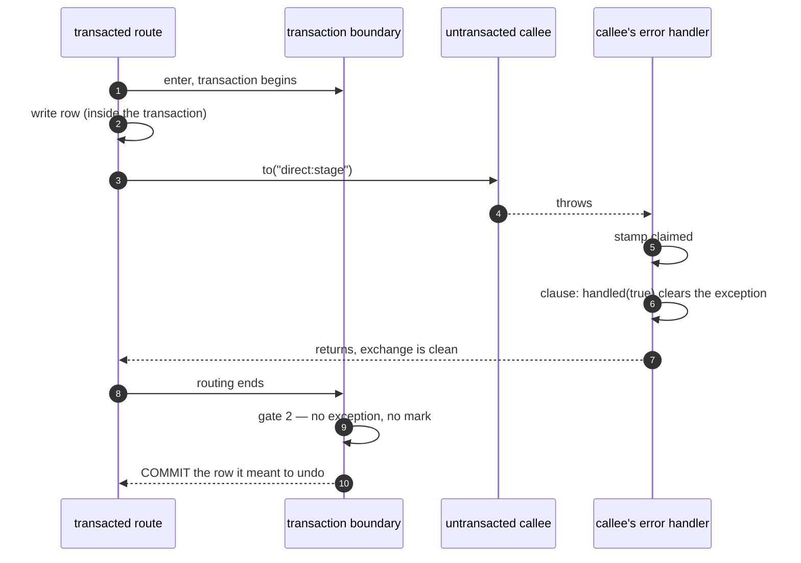

# Where to Cut a Camel Application

*An evidence-backed guide to execution boundaries: error ownership, transactions,
retry, threading and backpressure.*

What each boundary commits you to — who owns a failure, what commits, what retries,
whose thread it spends, what happens when it is too slow — and what the machine does
underneath. Written after `.transacted()` was found to be committing the writes it was
supposed to undo.

Camel's own manual describes the constructs. This describes the *interactions between*
them, which is where the surprises live.

> [!IMPORTANT]
> **Every claim here carries its provenance.** A statement is either reproduced by a
> [probe you can open and run](src/test/java/sandbox), cited to a method in the
> `camel-4.18.0` sources, or marked *not measured*. There is no fourth category, and
> plausible reasoning is not one of them — it turns out to be wrong about as often as it
> is right. See [METHOD.md](METHOD.md) for versions, configuration and how to run the
> suite; [README.md](README.md) for the property tables and the review card.

## How to read this

**Designing a route?** Work down [part one](#part-one--the-cut) in order — each answer
changes what the next question means — then [part two](#part-two--capacity) for
threading and load, then [part four](#part-four--work-no-cut-covers) for the effects a
rollback cannot undo.

**Debugging something?** Start from the property tables in
[README.md](README.md), which index every construct against every property, or jump to
[part three](#part-three--mechanism), which is reference rather than reading.

## Vocabulary

Camel's internal names for the three things it stamps on an exchange are unmemorable, so
this document uses plain ones throughout. If you arrived here from a stack trace or a
debugger, this is the table you want:

| This document | Camel calls it | What it means |
|---|---|---|
| **Claimed** | `failureHandled` | Some handler has taken responsibility for this failure. No `onException` anywhere will see it again. |
| **Handled** | `errorHandlerHandled` | Set by `handled(true)`. The failure became the outcome, so the exchange is a success from here on — and routing stops in every enclosing route. |
| **Rollback mark** | `rollbackOnly` | Abort the transaction, with no exception to carry it. Also stops routing, immediately, wherever it is set. |

The two that trip people up are **claimed** and **handled**, because they gate different
machinery: claimed suppresses *mapping*, handled suppresses *routing*. Part three's
[two gates](#two-gates-and-they-do-not-ask-the-same-question) is the short version.

---

# Part one — the cut

One sequence, read in order. Each answer changes what the next question means, which is
why they are numbered rather than listed. Everything else here exists to serve this:
part two is capacity, part three is what the machine actually does, and part four is the
work no cut can contain.

## 1. Should it be its own route?

Break it out when it is reused by more than one caller, when it needs its own
transaction boundary, or when it needs different error ownership from its caller.

Otherwise inline it. A `direct:` hop that exists only to name a section of a route still
adds a boundary you then have to reason about at every question below.

And be clear about what breaking it out actually buys. A route boundary is a boundary
for **naming and reuse**. It is not automatically a boundary for failure, for the
transaction, or for retry — each of those is a separate decision further down this list,
and [the splitting question](#7-does-splitting-the-stage-split-the-commit) is the case
where a stage split out for entirely good reasons turns out to share a transaction with
its caller regardless.

It can also do the opposite, and worse. Moving a step into its own untransacted route
moves its failures into a *different error handler* — one that will claim and clear them
before the caller's transaction boundary ever learns anything went wrong. That is the
exact mechanism of the commit-on-failure described in
[part three](#part-three--mechanism), and this refactor is what produces it.

## 2. Who is waiting for the answer?

Ask this before anything else about error handling, because it decides what
`handled(true)` — the setting on an `onException` clause that declares the failure has
become the outcome — actually *means*. The construct is the same in both worlds; the
consequence is opposite.

- **Request/reply** — HTTP, a unary gRPC call, and any `direct:` chain beneath either. A
  caller is blocked waiting for an answer, so marking a failure handled means *this is
  the answer*. Something must handle it or the caller gets nothing useful. The edge owns
  errors by necessity.
- **Fire-and-forget** — JMS, SQS, SEDA, timers, file. Nobody is waiting. Marking a
  failure handled means *acknowledge and drop it*: the broker sees a success, deletes the
  message, and never redelivers.

So on a broker consumer, decide what the broker should do *first*, then pick the
construct. But the construct is only half of it, because when the message is
acknowledged decides whether the broker is listening at all:

| Consumer | What the route does | Deliveries | Ends up |
|---|---|---|---|
| plain — the default | leaves the failure live | **1** | acknowledged and **lost** [probe](src/test/java/sandbox/BrokerProbe.java "onAPlainConsumer_anUnhandledFailureIsAcknowledgedAndLost") |
| `transacted=true` | leaves the failure live | **3** | dead-letter queue [probe](src/test/java/sandbox/BrokerProbe.java "onATransactedConsumer_anUnhandledFailureIsRedeliveredThenDeadLettered") |
| `transacted=true` | `handled(true)` | **1** | acknowledged and dropped, deliberately [probe](src/test/java/sandbox/BrokerProbe.java "mappingTheFailure_acknowledgesAndDropsTheMessage") |
| `transacted=true` | … + `markRollbackOnly()` | **3** | dead-letter queue [probe](src/test/java/sandbox/BrokerProbe.java "addingTheRollbackMark_bringsTheRedeliveryBack") |

`seda:` is on the fire-and-forget side of that list but answers differently, and worse.
Start with the part that is easy to get wrong: **a send to `seda:` is not
unconditionally fire-and-forget.** The default, `waitForTaskToComplete=IfReplyExpected`,
waits whenever the exchange expects a reply and returns immediately when it does not —
so the same line of DSL is a dispatch in one route and a blocking call in another. When
it does wait it enqueues a *copy*, blocks on a latch (30 seconds by default, then an
`ExchangeTimedOutException`), and copies the result — body, headers, exception — back
onto the caller's exchange. `Always` and `Never` take the decision away from the message
pattern. [source](https://github.com/apache/camel/blob/camel-4.18.0/components/camel-seda/src/main/java/org/apache/camel/component/seda/SedaProducer.java)

So the sender *can* hear about a failure. It still cannot act on it: the consuming
route's own error handler has claimed the failure by then, so the sender is stopped
rather than given a decision, unless that route declines with `noErrorHandler()`. And
nothing acknowledges an in-memory message, so there is nothing to un-acknowledge — a
failed message is delivered once and gone, with no transacted option to switch
redelivery on and no dead-letter queue unless you build one from an error handler.
Measured, all of it. [probe](src/test/java/sandbox/SedaSemanticsProbe.java "aFailedMessageIsNotRedelivered_itIsSimplyGone")

> [!WARNING]
> **Leaving the exception alone is not enough**
>
> The first row is the one that costs you messages, and the reason is **when the message
> gets acknowledged**. By default the JMS session acknowledges each message as it is
> handed to your route, so by the time the route fails the broker has already been told
> it was taken. A live exception buys nothing: delivered once, not redelivered, never
> dead-lettered. Simply gone.
>
> `transacted=true` moves the acknowledgement to the end. Camel wraps each delivery in a
> *local JMS transaction* — acknowledgement only, nothing to do with your database — and
> aborting it un-acknowledges the message. That is what makes the rollback and the retry
> one event, and only then does declining to handle a failure mean "send it back".
> [source](https://github.com/apache/camel/blob/camel-4.18.0/components/camel-jms/src/main/java/org/apache/camel/component/jms/JmsConfiguration.java)

With that in place: handle a poison message you want logged and discarded; leave a
transient failure alone so it comes back; and add `markRollbackOnly()` when you need
both a mapped outcome and a redelivery.

> [!NOTE]
> **Do not stack two retry layers**
>
> A broker already has a redelivery policy and a DLQ. Adding Camel redelivery on top
> multiplies the attempts and delays the DLQ by the product of the two. Pick one place to
> own retry — normally the broker — and leave the other at a single attempt.

## 3. Should it own its errors?

Putting an error handler on a reusable stage is a **declaration**, not an implementation
detail. It claims the right to interrupt the consumer: whatever that stage decides the
failure becomes is what every caller gets, and no caller has a say after the fact.

So a shared stage should carry *clauses* only when it actually wants that power — when
it can turn a failure into an outcome that is right for every caller it has. Declining
is a separate, explicit act: `errorHandler(noErrorHandler())`, which leaves the decision
where the context to make it lives. Writing no clauses is not declining — the stage
still claims, it just has nothing to say.
[probe](src/test/java/sandbox/DefaultHandlerProbe.java "noClausesAtAll_stillClaimsTheFailure_soTheCallersClauseNeverFires")

> [!WARNING]
> **A transacted stage cannot decline**
>
> `.transacted()` replaces the route's error handler with the transaction one, and it
> wins: `errorHandler(noErrorHandler())` written on a transacted route is overridden, the
> failure is claimed, and the caller's clause never fires.
> [probe](src/test/java/sandbox/TransactedDeclineProbe.java "aTransactedRouteCannotDecline_noErrorHandlerIsOverridden")
> Declining is only available to a stage that is not itself a transaction boundary.
>
> Which sets the honest limit on the convention. Making helper routes decline by default
> is a real improvement — it stops a routine refactor from silently changing who owns a
> failure. But it **does not fix transactional work**, because the routes that most need
> fixing are exactly the ones that cannot take part. What it buys is narrower and still
> worth having: it shrinks the set of stages you have to think hard about down to the
> transaction boundaries, and those you then reason about one at a time. A convention
> that quietly excludes its most dangerous cases is worth adopting and worth not
> overselling.
>
> That leaves a caller three ways to recover from a transacted callee. The callee can
> **map the failure to an ordinary result** — a clause with `handled(true)` that sets a
> body the caller inspects, so what comes back is a value rather than a failure. The
> caller can wrap the call in `doTry`/`doCatch`, which reaches the catch even though the
> exchange is claimed — and the callee's transaction still rolls back.
> [probe](src/test/java/sandbox/TransactedCatchProbe.java "doCatchReachesAFailureFromATransactedCallee_andTheRollbackStillHappens")
> Or the transaction boundary moves up to the caller, so there is no transacted callee to
> recover from. The middle one is usually right, and it is the next question.

Callers of a stage that *does* claim it have two options: respect the interruption, or
defend against it with `doTry`/`doCatch` — which only works if the stage left the
exception intact. That is the next question.

## 4. Does a caller need to recover from it?

Then the callee must not mark the failure *handled*. Both `noErrorHandler()` and a plain
`onException(X)` leave the exception in place, and either is enough —
`doTry`/`doCatch` walks its own clause list without consulting the checks that decide
whether routing continues, so it still reaches the catch on a failed exchange.
[source](https://github.com/apache/camel/blob/camel-4.18.0/core/camel-core-processor/src/main/java/org/apache/camel/processor/TryProcessor.java)
It reaches it on a *claimed* one too, which is why it is the only recovery left when the
callee is transacted and cannot decline.

You can also hand the failure onward from inside the catch, but only upward and only
sometimes. A throw there never reaches *this* route's clauses — the block has no error
handler — and if **nothing had claimed the exchange** it leaves unclaimed, so the first
handler to see it is the caller's, and that one maps it normally.
[probe](src/test/java/sandbox/CatchEscapeProbe.java "anUnclaimedRethrowFromACatchIsMappedByTheCaller")
Under a shared base class the caller carries the same clauses, which makes the result
indistinguishable from the route having mapped itself.

```java
from("direct:fetch-thing")
    .errorHandler(noErrorHandler())   // declines ownership
    ...

// caller
.doTry()
    .to("direct:fetch-thing")
.doCatch(SomeException.class)
    .setBody(constant(DEFAULT))
.end()
.to("direct:carry-on")               // runs on both paths
```

`continued(true)` is the other option, and it is not *necessarily* builder-wide — an
`onException` can be attached to a single route inline, though written in `configure()`
it applies to every route in the builder. So choose on behaviour, not scope.
`continued(true)` resumes *inside the route that failed*, skipping only the step that
threw, and clears any rollback mark on its way through.
[probe](src/test/java/sandbox/ContinuedProbe.java "continuedSkipsTheFailingStepAndRunsTheRest")
`doCatch` resumes at the call site, and saves and restores a mark set before the
`doTry`.

> [!WARNING]
> **And it stops working when someone extracts a route**
>
> That only works because nothing claimed the failure. Replace the step inside the
> `doTry` with a call to another route, and that route's handler claims it — at which
> point every handler afterwards treats the exchange as finished, the caller's clause is
> skipped, and the identical rethrow reaches nobody. The client gets an empty
> `text/plain` instead of the mapped body.
> [probe](src/test/java/sandbox/CatchRethrowProbe.java "norDoesTheCallersClauseMapAThrowAfterAClaimedCallee")
>
> Nothing at the call site changed. The thing being called did. This is
> [the route question](#1-should-it-be-its-own-route) wearing a second hat: extracting
> steps into their own route silently moves who owns their failures, and here it converts
> a working error path into a blank 500.

> [!NOTE]
> **What a claim costs, which is narrower and worse than it sounds**
>
> A claimed exchange is not broken, and that is the problem. Routing still reaches the
> end of the route, a later `doTry`/`doCatch` still catches, `setHeader` and `setBody`
> still land, and the exchange still ends clean if nothing is left thrown.
> [probe](src/test/java/sandbox/CatchRethrowProbe.java "aClaimedExchangeStillRoutes_catchesAndSetsHeaders_itOnlyLosesMapping")
> Exactly one capability is gone — being mapped by a clause — and it is gone for the rest
> of the exchange's life. Because `direct:` keeps the same exchange, that includes the
> caller's own later steps, not just the route where the claim happened.
>
> So the failure mode is a route that runs to completion and returns a response, in which
> a *thrown* domain exception has quietly stopped becoming a status code. You get a 500
> where you meant a 409, on a route where everything else works, and no test that asserts
> only on the happy path will see it.

> [!WARNING]
> **Not a reachable configuration**
>
> "The callee handles its own errors *and* the caller also handles them" cannot be built.
> If the callee marked the failure handled, the exception is gone, and a `doCatch` with
> nothing to catch exits immediately.
> [source](https://github.com/apache/camel/blob/camel-4.18.0/core/camel-core-processor/src/main/java/org/apache/camel/processor/CatchProcessor.java)
> Declining in the callee is the precondition for the caller catching anything at all.

## 5. What can still be translated after the first failure?

Less than you would expect, and the answer is not scoped to the stage that failed. A
claim lasts the **exchange's** lifetime, so once any handler has seen a failure, no
clause will map anything on that exchange again — including later failures that have
nothing to do with the first, in routes that had not been entered when it happened.

Everything else keeps working, which is what makes this hard to see. On a claimed
exchange: routing reaches the end of the route, a later `doTry`/`doCatch` still catches,
`setHeader` and `setBody` still land, and the exchange still ends clean if nothing is
left thrown.
[probe](src/test/java/sandbox/CatchRethrowProbe.java "aClaimedExchangeStillRoutes_catchesAndSetsHeaders_itOnlyLosesMapping")
Exactly one capability is gone: **turning a thrown exception into a response**.

> [!IMPORTANT]
> **Which is why this bites request/reply apps and not broker ones**
>
> A broker-driven route gets a *fresh exchange per delivery*. The claim's lifetime is one
> message, the next message starts clean, and the whole problem is invisible. A
> request/reply application threads *one exchange through the entire request* — edge,
> orchestration, every stage beneath. The first claim anywhere in that tree disables
> clause mapping for everything that comes after it.
>
> Same mechanism, wildly different blast radius, and it explains why a framework whose
> error model was built for messaging can carry this comfortably for years.

> [!IMPORTANT]
> **Resuming after a failure is confined to one construct**
>
> `continued(true)` is the only thing in Camel that resumes routing *and* resets the
> exchange's error state. It is a clause, so it is only reachable for a failure nothing
> has claimed yet — which is precisely not the case when you are recovering from a stage
> that has an error handler of its own. `doTry`/`doCatch` reaches further, and resets
> nothing: routing continues, and the exchange stays unmappable for the rest of its life.
>
> So handling exceptions at **more than one level** — recovering at a stage boundary and
> still translating a later failure at the edge — has no idiomatic form. What is left are
> three workarounds, and none of them is a design:
>
> - **Cross a boundary** so a fresh exchange is created, changing the architecture to
>   work around an error-handling limitation.
> - **Keep error handlers off the intermediate routes** — unavailable for a transacted
>   one, which cannot decline and which must throw for its transaction to roll back at
>   all.
> - **Reset the exchange by hand**, below.
>
> It bites hardest in request/reply, where one exchange spans the whole request and
> boundaries are crossed rarely. In-only applications meet the same wall, just less
> often, because each delivery starts a fresh exchange.

**Resetting by hand** puts the reset where the recovery already is: inside the `doCatch`
that reached the failure, which against a stage that cannot decline is the only thing
that reaches it at all. That placement is what keeps it to two lines, because the catch
has already done the rest — it records the cause, clears the exception, and clears
`routeStop` and the redelivery-exhausted flag before the body runs.
[probe](src/test/java/sandbox/CatchRestoreProbe.java "routeStopAndRedeliveryExhaustedAreAlreadyClearedBeforeTheBodyRuns")
What a catch does not do is clear the two flags that gate future mapping, so that is all
a reset has to add:

```java
class MarkRecovered implements Processor {
    public void process(Exchange ex) {
        ex.getExchangeExtension().setFailureHandled(false);      // the claim
        ex.getExchangeExtension().setErrorHandlerHandled(null);  // and the verdict
    }
}

.doTry()
    .to("direct:transacted-stage")
.doCatch(StageFailed.class)
    .process(RECOVERED)   // in the catch, not after end()
.end()
```

> [!IMPORTANT]
> **In the catch, not after it — and the rollback mark is not yours to keep or lose**
>
> A catch **snapshots** `routeStop`, the rollback mark and `rollbackOnlyLast` on entry,
> clears all three so the body can run, and puts them back in its completion callback.
> Three consequences, all measured:
> [probe](src/test/java/sandbox/CatchRestoreProbe.java "theRollbackMarkIsInvisibleInsideTheCatchAndRestoredAfterIt")
>
> - The rollback mark reads **false** inside the catch and is true again after `end()`.
>   Anything in the body that consults it is reading a value the exchange does not have.
> - Clearing it from inside is **discarded on the way out**. So this reset cannot overturn
>   an abort even if it tried — keeping the mark is enforced here, not merely intended,
>   and the hazard `continued(true)` carries is out of reach.
> - An exchange carrying a mark **stops routing at the first step after `end()`**, because
>   the restored mark satisfies the gate. A reset placed there is never reached, in
>   exactly the cases you wanted it.
>
> And a sharper one: on a marked exchange a caught `RollbackExchangeException` is re-set
> on the exchange after the body, so that catch recovers from nothing.
> [probe](src/test/java/sandbox/CatchRestoreProbe.java "aCaughtRollbackExceptionIsPutBackOnTheExchange")

> [!IMPORTANT]
> **Choosing where it goes**
>
> Its position in the catch body *is* the statement of what it covers: everything after
> it runs on a clean exchange, everything before it on a claimed one. Four shapes cover
> most cases.
> [probe](src/test/java/sandbox/ContinuePlacementProbe.java "first_letsARouteTheBodyCallsMapItsOwnFailure")
>
> - **Truly ignore the failure** — the processor alone, or first with the rest of the body
>   after it. Everything that follows, inside the catch and past `end()`, behaves
>   normally: routes it calls use their own error handlers, and a later failure maps.
> - **Compensate, and give up if the compensation fails** — last. The compensation runs
>   claimed, so nothing can map its failure; if it throws, the processor is never reached
>   and the exchange arrives at the consumer unmappable. Recovery is only asserted once it
>   has actually happened.
> - **Compensate, and handle the compensation's failures yourself** — last, with the
>   compensation wrapped in a nested `doTry`/`doCatch`. No clause fires while the exchange
>   is still claimed, so the inner catch is where you set a body or decide to rethrow:
>   handling by hand, not mapping. Routing then carries on to the reset placed after it.
> - **Compensate using a route whose own error handler must fire** — first, with a nested
>   `doTry`/`doCatch` around the call. Only the reset brings that route's clauses back to
>   life; the guard then catches whatever it declines or rethrows.
>
> One and four need it first, two and three need it last, and only four is impossible in
> the other position — the rest are preferences about what a failed recovery should mean.
>
> The caveat on four: if the compensation route resolves the failure itself with
> `handled(true)`, it stops your route at the point of the call — including the rest of
> the catch body — and its own body becomes the response. Nothing throws, so the guard
> cannot intervene.
> [probe](src/test/java/sandbox/ContinuePlacementProbe.java "aHandlingCompensationRouteEndsTheCatchBodyAndTheRouteWithItsOwnBody")

Measured in the shape that has no other answer: the stage throws so its transaction rolls
back, the caller catches to carry on, and a later failure is mapped normally by the edge
on a clean exchange. The rollback still happened — resetting error state is not a second
chance at the transaction, and nothing here resurrects the stage's work.
[probe](src/test/java/sandbox/MarkRecoveredProbe.java "withIt_theRollbackStillHappenedAndTheLaterFailureMapsNormally")

> [!NOTE]
> **Before you reach for it**
>
> It is `ExchangeExtension`, which is not application-facing API and carries no
> compatibility promise. And it destroys information: after it runs, nothing on the
> exchange records that an earlier stage failed, so anything downstream that would have
> consulted that — a completion hook, a compensation, an audit trail — sees a clean
> exchange. The caught exception is kept as a property, as `continued(true)` keeps it, so
> the cause at least remains readable.
> [probe](src/test/java/sandbox/MarkRecoveredProbe.java "theCauseIsStillReadableAfterwards")
> Use it deliberately at a boundary you own, not as a global filter.
>
> It is a workaround for a missing lever, not a pattern, and it is written here as one.
> The thing that would remove the need for it is small — an opt-in on `doCatch`
> performing the reset that `continued(true)` already performs — and worth raising
> upstream.

> [!WARNING]
> **Do not build a propagation model on this**
>
> Once you can reset an exchange at will, it is tempting to go further and rebuild general
> exception propagation — catch at one level, translate, rethrow, catch again higher up,
> the way every programming language and several other integration frameworks let you.
> **Don't.** It works, and it produces a Camel application that no Camel developer can
> reason about: error flow that is invisible to `onException`, a route whose behaviour
> depends on internal flags no reviewer will think to check, and a codebase whose failure
> paths cannot be understood from the DSL at all.
>
> Use it as a repair at a single boundary you own and can point at, where the alternative
> is a wrong response reaching a client. Not as a foundation.

## 6. What is the transaction boundary?

- `.transacted()` covers the **whole route body**, wherever in the route you write it.
  [probe](src/test/java/sandbox/TransactedPositionProbe.java "aWriteAboveTheBoundaryIsStillInsideTheTransaction")
- Sibling transacted routes are **separate transactions**. A transacted caller makes them
  one. [probe](src/test/java/sandbox/NestedTransactionProbe.java "aTransactedCallerAbsorbsATransactedCallee_soOneRollbackTakesEverything")
- Any clause that turns a failure into a response must end with `.markRollbackOnly()`, as
  the last step written in the clause.
- Work that a rollback cannot undo — object writes, identity-provider calls, outbound
  webhooks — does not belong inside the transacted route. Order it to fail safe, or
  compensate explicitly. That is [part four](#part-four--work-no-cut-covers).
- On a transacted broker consumer the rollback **is** the retry: aborting the transaction
  un-acknowledges the message, so it comes back. Rolling back and redelivering are one
  event, not two.
  [probe](src/test/java/sandbox/BrokerProbe.java "addingTheRollbackMark_bringsTheRedeliveryBack")

## 7. Does splitting the stage split the commit?

Usually not, and this is where a boundary drawn for good reasons in the questions above
turns out to buy nothing. Four arrangements, four different answers:

| Caller | Callee | Callee aborts with | Transactions | Caller's writes |
|---|---|---|---|---|
| `.transacted()` | `.transacted()` | `markRollbackOnly()` | one | **gone** |
| plain | `.transacted()` | `markRollbackOnly()` | one each | none to lose |
| `.transacted()` | `REQUIRES_NEW` | `markRollbackOnly()` | two | **gone anyway** |
| `.transacted()` | `REQUIRES_NEW` | `markRollbackOnlyLast()` | two | kept |

[probe](src/test/java/sandbox/NestedTransactionProbe.java "requiresNew_isNotEnough_becauseTheMarkTravelsOnTheExchange")

The third row is the one that surprises. `REQUIRES_NEW` genuinely gives the callee its own
transaction — and the caller's still rolls back, because `markRollbackOnly()` sets the
mark on **the exchange**, and the exchange is shared across a `direct:` call. The caller's
boundary reads the same mark on the way out. Isolating a callee takes both halves: its own
propagation, *and* an abort that clears the mark behind it.
[source](https://github.com/apache/camel/blob/camel-4.18.0/core/camel-core-processor/src/main/java/org/apache/camel/processor/RollbackProcessor.java)

> [!NOTE]
> **This row is Spring's answer, and the reason once given here was wrong**
>
> The fourth row is measured on Spring's transaction manager, whose rollback condition
> includes `rollbackOnlyLast` where `camel-jta`'s omits it. This document used to predict
> from that difference that a JTA provider would *commit* instead. Measured since, the
> reasoning does not survive: under `camel-jta` the transaction completes **before the
> clause that sets the mark has run**, so the mark is never read and the two rollback
> conditions never get the chance to differ.
> [probe](src/test/java/sandbox/JtaFidelityProbe.java "underJta_markRollbackOnlyLastMakesNoDifference")
> What a JTA provider does with this nested arrangement is unmeasured — take the row as
> Spring's answer only.

**Splitters and aggregators are the unmeasured corner of this question.** A `split()` with
`shareUnitOfWork` changes whether a sub-exchange's failure reaches the parent's boundary,
`stopOnException` changes whether the rest of the split still runs, and a persistent
aggregation repository is a second store with its own commit. None of that is probed here;
what *is* established is the piece it rests on — `multicast()` children get no error
handler at all, and neither does the parent unless `shareUnitOfWork` is set, which is the
same rule described in
[where error handling is switched off](#where-error-handling-is-switched-off).
*Not measured beyond that.*

## 8. Where does the thread change, and what happens when it is too slow?

Both of those are properties of every boundary above rather than one more place to cut, so
they have a part to themselves: [part two](#part-two--capacity). Two things to carry into
it from here.

**A route has no concurrency of its own.** It comes from the consumer that feeds it —
`concurrentConsumers`, a poller's batch size — and a route entered through `direct:`
inherits whatever thread its caller was on.
[probe](src/test/java/sandbox/BrokerThreadingProbe.java "concurrentConsumersIsTheConcurrencyBound_andEachGetsItsOwnThread")

**And a transaction pins a route to one thread**, which quietly removes the hop you asked
for: `.threads()` inside `.transacted()` is suppressed outright.
[probe](src/test/java/sandbox/ThreadingProbe.java "insideATransaction_threadsIsSilentlyIgnored")

---

# Part two — capacity

Threading and backpressure are two questions, and they get conflated constantly. They are
independent:

| Question | The tool | What it costs |
|---|---|---|
| Am I about to block a thread I do not own? | `.threads()`, a queue endpoint | A real hop — enqueue, wakeup, a cold cache |
| How much work do I admit to this dependency? | A pool's bounds, or a bulkhead | A ceiling, and something to say when it is reached |

Hopping does not bound anything, and bounding does not move the work. Most confused
capacity configuration is one of those two reached for when the other was wanted.

## Where the thread changes

| Construct | Thread | What does not come with you |
|---|---|---|
| `direct:` | same [probe](src/test/java/sandbox/ThreadingProbe.java "aDirectCallStaysOnTheCallersThread") | nothing — it is a method call |
| `.threads()` | new — *except* inside a transaction [probe](src/test/java/sandbox/ThreadingProbe.java "insideATransaction_threadsIsSilentlyIgnored") | suppressed outright when the exchange is transacted |
| `wireTap` | new [probe](src/test/java/sandbox/ThreadingProbe.java "aWireTapRunsOnItsOwnThread") | the original does not wait; the tap gets a copy |
| `seda:` | new [probe](src/test/java/sandbox/ThreadingProbe.java "aQueueEndpointMovesTheWorkToAConsumerThread") | the transaction, and the consumer's failures |
| `.circuitBreaker()` | same, unless `timeoutEnabled` [probe](src/test/java/sandbox/CircuitBreakerProbe.java "byDefaultTheCallRunsOnTheCallersThread") | a semaphore, not a pool — until the time limiter makes it one |

> [!WARNING]
> **Two hops, and only one of them respects a transaction**
>
> A transaction is bound to a thread, so a hop inside one is either refused or fatal to it
> — and Camel is inconsistent about which. `.threads()` is **refused**: `ThreadsProcessor`
> returns immediately when the exchange is transacted, so the hop silently does not happen
> and atomicity survives. You get less concurrency than you asked for and no warning.
> Resilience4j's time limiter is **not** refused, because it is not Camel's processor: a
> write inside a breaker with `timeoutEnabled` ran on another thread, outside the
> transaction, and *committed* while the write before it rolled back.
> [probe](src/test/java/sandbox/CircuitBreakerProbe.java "aTimeLimiterInsideATransaction_movesTheWorkOutOfIt")
>
> Same shape as the failure in [part three](#part-three--mechanism), reached through a
> flag that reads like a timeout. Use the component's own timeout instead, and treat any
> thread hop inside `.transacted()` as either useless or dangerous.

**Hop when you are about to block on a thread you do not own.** Not on type transitions,
not to be safe. A hop is a real cost — enqueue, wakeup, a cold cache — and an unnecessary
one buys nothing.

Which is harder to place than it sounds, because *the thread you are on is not the thread
you started on*. A non-blocking producer really does give the thread back: the step after
it runs on the thread that received the response, not on the one that made the call.
[probe](src/test/java/sandbox/AsyncContinuationProbe.java "anAsyncProducerReleasesTheCallersThread_andTheRestOfTheRouteRunsOnTheResponseThread")
So a route that queries a database and then calls a non-blocking HTTP service needs no hop
— the async producer releases the thread by itself. Reverse the two and you must hop,
because the database call would otherwise land on an event loop. The same two components,
the same route, opposite answers.

> [!NOTE]
> **Verify rather than trust any list, including the one below**
>
> Log `Thread.currentThread().getName()` immediately before the call you think blocks. The
> name tells you the answer: an event-loop thread means fix it now, a shared worker pool
> means it works but is not isolated, and a named Camel pool means you placed the bound
> deliberately. Measured here: a route behind `platform-http-vertx` runs on
> `vert.x-worker-thread-0` — the consumer wraps routing in `executeBlocking`, so you are
> never on the event loop, but you are on a pool shared with everything else.
> [probe](src/test/java/sandbox/HttpConsumerProbe.java "aRouteRunsOnAVertxWorkerThread_notTheEventLoop")
>
> [Which producers block](#which-producers-block) in part three is the list, with the rule
> that makes it checkable.

## How many pools, and what goes in them

Camel will happily give you a pool per `.threads()` call and never mention it, so pool
topology is a decision you make by default if you do not make it deliberately.

**One pool per resource class, shared across routes.** Group by what the threads *wait
on* — `db`, `legacy-soap`, `file-io`. Three or four profiles covers most applications.

Not one global pool: a single sick dependency then starves every healthy piece of work in
the process, which is the failure a bulkhead exists to prevent and a shared pool
reintroduces.

And **not one per `.threads()` call**, which is what you get for free. A `.threads()` with
no `executorService` makes `ThreadsReifier` build a fresh `ThreadPoolProfile` and call
`newThreadPool` for that definition alone, so five of them are five independent pools of
10 core / 20 max threads that nobody sized and nothing bounds jointly.
[source](https://github.com/apache/camel/blob/camel-4.18.0/core/camel-core-reifier/src/main/java/org/apache/camel/reifier/ThreadsReifier.java)
It is an invisible boundary in exactly the sense this document uses elsewhere: the route
reads as one hop, and the capacity it commits is not written anywhere.

```properties
camel.threadpool.config[db].pool-size       = 20
camel.threadpool.config[db].max-pool-size   = 20
camel.threadpool.config[db].max-queue-size  = 50
camel.threadpool.config[db].rejected-policy = Abort
```

Naming that profile on the hop is also what carries its **rejection policy** across:
`ThreadsReifier.resolveRejectedPolicy` looks the `executorService` reference up as a
*profile* and takes its policy. A reference that names a bean rather than a profile finds
none, and falls back to `callerRunsWhenRejected`, which defaults to true.
[probe](src/test/java/sandbox/RejectionPolicyProbe.java "anAbortProfileArrivesAsAMappableFailure_soTheRouteCanAnswer429")

```java
.threads().executorService("db")   // the profile above, Abort and all
```

## Pool or bulkhead?

They overlap more than their names suggest, and stacking them is usually a mistake.

**If you are blocking, a well-configured pool already is a bulkhead** — bounded
concurrency, a bounded queue, and a rejection you can catch. A second ceiling in front of
it adds a number to tune and no isolation you did not have. *Reasoning, not measured.*

A bulkhead earns its place in three cases: in front of a **non-blocking** call, where
there is no pool to bound in the first place; where you want to subdivide one pool at a
finer granularity than a profile; and because Resilience4j bundles it with the circuit
breaker, which is worth more than either.

If you do use both, **the hop goes outside and the bulkhead inside**. The reverse holds a
permit while the work is still queued for a thread, so the permit is spent measuring your
own queue rather than the dependency's capacity. *Reasoning, not measured.*

## What happens when it is too slow

Every thread boundary has a queue, whether you chose one or not, and every queue is
bounded. The only real question is what the producer is told when it fills — and the
answers are one option apart:

| Boundary | When full, the producer | What that costs |
|---|---|---|
| `seda:` — the default | gets an exception [probe](src/test/java/sandbox/BackpressureProbe.java "aFullQueueThrowsAtTheProducerByDefault") | backpressure you must catch and answer for |
| `blockWhenFull=true` | parks until there is room [probe](src/test/java/sandbox/BackpressureProbe.java "blockWhenFull_turnsTheProducerIntoTheBrake") | real backpressure, and a thread held with no timeout |
| `discardWhenFull=true` | is told nothing [probe](src/test/java/sandbox/BackpressureProbe.java "discardWhenFull_losesTheMessageAndTellsNobody") | overload becomes silent data loss |
| `.threads()` — CallerRuns, the default | runs the work itself [probe](src/test/java/sandbox/BackpressureProbe.java "aRejectedPoolTaskRunsOnTheCallersThread_becauseTheDefaultIsCallerRuns") | the hop silently stops happening under load |
| HTTP edge — the client is the producer | waits, and is told nothing [probe](src/test/java/sandbox/HttpBackpressureProbe.java "excessRequestsQueueInvisibly_ratherThanBeingRefused") | an unbounded queue at the front door |

One boundary on that list has a queue you will not find by reading the route at all. A
`.transacted()` stage takes a database connection when the boundary *opens*, not when the
first statement runs, and holds it for every step of the body. A transacted route issuing
no SQL whatsoever still ran only as many copies concurrently as the pool had connections,
and the excess failed on the pool's timeout.
[probe](src/test/java/sandbox/TransactedBackpressureProbe.java "aTransactedRouteHoldsAConnectionForItsWholeBody_evenWithoutSql")
So the concurrency of a transacted route is the pool size, and a slow call inside one — an
HTTP request, a model call — is holding a database connection for its entire duration
while touching no database.

The last row deserves its own moment, because it is the boundary your users actually
arrive through. Forty concurrent requests against a slow route produced exactly twenty
concurrent executions — the Vert.x worker pool's default size — and the other twenty were
neither refused nor answered. They waited. Nothing returned 503, nothing shed load, and
nothing in the route declares that a pool of twenty is the concurrency of the entire edge.
The queue is real, it is unbounded, and the only thing that eventually drains it is clients
giving up.

> [!IMPORTANT]
> **And you can give it a ceiling**
>
> The Vert.x worker queue itself is not yours to bound — but you do not need it to be. Put
> the ceiling in the route, in front of the work, and a rejection releases the worker
> thread immediately instead of holding it. A bulkhead is the cheapest form: a semaphore,
> no extra pool, no thread hop. Ten concurrent requests against two permits, and the eight
> that could not get one were **refused at once with 503 and a `Retry-After`** rather than
> queueing:
> [probe](src/test/java/sandbox/HttpLoadSheddingProbe.java "aBulkheadTurnsAnInvisibleQueueIntoAnHonest503")
>
> ```java
> from("platform-http:/orders")
>     .circuitBreaker()
>         .resilience4jConfiguration()
>             .bulkheadEnabled(true)
>             .bulkheadMaxConcurrentCalls(20)
>             .bulkheadMaxWaitDuration(0)     // shed, do not queue
>         .end()
>         .to("direct:place-order")
>     .onFallback()
>         .setHeader(HTTP_RESPONSE_CODE, constant(503))
>         .setHeader("Retry-After", constant("1"))
>         .setBody(constant(OVERLOADED))
>     .end();
> ```
>
> Two details make it work. The ceiling must be *below* the worker pool or it never
> engages — a bulkhead of 50 in front of a pool of 20 is decoration. And the refusal
> carries a real body only because the fallback cleared the exception: an overload left
> unhandled would reach the client as the empty `text/plain` from
> [part three](#why-the-status-survives-but-the-body-does-not). Shedding load and
> returning a useful error are the same mechanism.

> [!NOTE]
> **503 or 429**
>
> They mean different things and the difference is worth keeping. **503 with
> `Retry-After`** says the service is out of capacity right now — which is what a full
> bulkhead is. **429** says this particular caller has exceeded its allowance, which is a
> policy about clients rather than a fact about capacity. Sending 429 for overload tells a
> well-behaved caller it did something wrong, and it did not.

A broker consumer belongs on that list too, and it is different in kind. With a consumer
that had processed one message and stopped, two hundred sends completed without blocking
or throwing — where `seda:` would have refused at its in-process limit, the backlog simply
moved to the broker.
[probe](src/test/java/sandbox/BrokerThreadingProbe.java "aSlowConsumerBacksUpInTheBroker_notInTheSender")
That is the real argument for a broker over an in-memory hop, and the real risk: **nothing
pushes back until the broker itself runs out of room**, and when it does, producer flow
control parks your send exactly as `blockWhenFull` would.
[probe](src/test/java/sandbox/BrokerThreadingProbe.java "whenTheBrokerRunsOutOfRoom_theProducerIsTheOneThatWaits")
A queue you cannot see filling is still a queue.

## Which rejection policy, and whose thread it belongs to

The `.threads()` row is the one to think hardest about. Camel's default rejection policy
is `CallerRuns`, and the documentation frames it as natural backpressure. It is — on a
worker thread that exists to be blocked. On an event loop it means the pool you added to
protect the event loop hands the work straight back to it, and every other connection
stalls. **The rejection policy belongs to the thread doing the submitting, not to the
source of the work.**

The choice is between exactly two policies, because those are the only two there are.
**Camel has no blocking rejection policy** — `Abort` and `CallerRuns` are the whole enum.
[probe](src/test/java/sandbox/RejectionPolicyProbe.java "thereIsNoBlockingRejectionPolicy")
Parking a producer until there is room is a queue-endpoint behaviour, available at `seda:`
through `blockWhenFull` and nowhere at a thread pool. A design that calls for it has to
move the boundary rather than configure it.

- A scarce or awaited caller — an event loop, an HTTP request thread — wants **Abort**.
  The rejection is *set on the exchange* rather than thrown at the sender, so the route's
  own clause maps a `RejectedExecutionException` like any other failure and the edge
  answers with a status instead of stalling.
  [probe](src/test/java/sandbox/RejectionPolicyProbe.java "anAbortProfileArrivesAsAMappableFailure_soTheRouteCanAnswer429")
- A cheap, blockable caller whose work must not be lost keeps **CallerRuns**, which is
  already the default. The hop stops happening under load and the submitting thread does
  the work — real backpressure on a thread that exists to be blocked, and the same
  behaviour that makes the default wrong on an event loop.
- A route with no pool in it submits nothing and needs no policy. A broker consumer
  feeding `direct:` is already bounded by its own concurrency, and that is usually the
  best of the three.

> [!IMPORTANT]
> **And a shared stage cannot answer this either**
>
> A route called by both an HTTP edge and a broker cannot satisfy both policies at once:
> one caller needs a refusal it can turn into a status, the other would rather run the
> work itself than shed it. This is the same argument as error ownership in
> [question 3](#3-should-it-own-its-errors), and it has the same answer — **push the
> `.threads()` out of the shared route and into each caller**. A stage that does not know
> its caller's protocol cannot choose a policy that is shaped by it.

## Retry, and why it does not compose with a breaker

> [!WARNING]
> **Retry and a circuit breaker do not compose the way they read**
>
> A failure inside `.circuitBreaker()` is **not redelivered**. The identical failure under
> the identical error handler was retried three times in an ordinary route and attempted
> *once* inside the block
> [probe](src/test/java/sandbox/CircuitBreakerRetryProbe.java "redeliveryDoesNotReEnterTheBreaker_soRetryQuietlyStopsAtItsEdge")
> — the breaker sets the exception on the exchange and returns rather than throwing
> through the channel, so redelivery never re-enters it. `maximumRedeliveries` applies
> everywhere in that route except there, and nothing says so.
>
> But move the retry one route out and it comes back, multiplied. A caller retrying a
> `.to()` whose callee contains a breaker re-enters the *route*, and therefore the breaker:
> three attempts became **three breaker calls**, each one a separate recorded failure.
> [probe](src/test/java/sandbox/CircuitBreakerRetryProbe.java "aCallersRetryDoesReEnterABreakerInACallee_soEachAttemptIsAnotherRecordedFailure")
> Redelivery cannot re-enter the block; it can re-enter the route around it. So where your
> retry sits decides whether it is invisible to the breaker or is quietly tripling the
> failure rate the breaker uses to decide whether to open at all.

> [!NOTE]
> **And a fallback switches retry off as a side effect**
>
> Add `onFallback` and the attempt count drops to one.
> [probe](src/test/java/sandbox/CircuitBreakerRetryProbe.java "aFallbackStopsRetryBeforeItStarts")
> The fallback clears the exception, so the error handler sees a success and has nothing
> to retry. This is the second time the same trap appears: giving an `onException` clause
> a body disables its retries, and giving a breaker a fallback disables retries around it.
> Neither construct mentions retry.

One consequence follows from the route-versus-block rule rather than from its own probe:
if the breaker carries a bulkhead, a caller's retry takes *another permit* each time,
because it re-enters the route. A retry policy in front of a bulkheaded dependency is
therefore spending the very capacity the bulkhead exists to ration, and it does so hardest
exactly when that dependency is already struggling. *Reasoning from the measured
route-versus-block rule, not separately probed.*

Worth saying plainly, though it is reasoning rather than measurement: a shed request and
an open circuit are both the system reporting that it has no capacity. Retrying either
immediately asks the same question expecting a different answer, and adds load to
something already short of it. If a retry belongs anywhere here it belongs at the caller,
after a delay — which is what `Retry-After` is for.

## Sizing, and the queue

Arithmetic rather than Camel behaviour, so take this section as reasoning except where a
number is cited.

Set `poolSize` equal to `maxPoolSize`. A `ThreadPoolExecutor` only grows past its core
size *after the queue fills*, and Camel builds the pool with a bounded
`LinkedBlockingQueue` of `maxQueueSize`
[source](https://github.com/apache/camel/blob/camel-4.18.0/core/camel-support/src/main/java/org/apache/camel/support/DefaultThreadPoolFactory.java)
— so with the measured defaults of 10 / 20 / 1000 you would queue a thousand tasks before
the eleventh thread is ever created, and `maxPoolSize` is decorative.

Size a blocking pool to the downstream's tolerance, or to its connection pool: a `db` pool
above the Hikari maximum just means threads waiting in `getConnection()`. Size a
CPU-bound pool near core count.

The queue absorbs bursts and adds no throughput; that comes from thread count alone. A
queued task is pure latency:

```
max wait ≈ queue_size ÷ (threads ÷ service_time)
```

Twenty threads at 50 ms drain 400/s, so a 50-deep queue is about 125 ms of worst-case
wait. **Keep that under the caller's remaining timeout budget** — a deeper queue mostly
guarantees you will serve callers who have already gone. Shallow for a synchronous source,
tens; deeper for a batch one where nobody is waiting and absorbing the burst beats
rejecting it.

## When there is no pool to bound

A non-blocking producer gives the thread back, so there is no pool to size and a semaphore
is the only bound left. Camel's bulkhead is off by default, allows 25 concurrent calls
when on, and waits *zero* for a permit, so a full one sheds immediately into `onFallback`
rather than queueing.
[probe](src/test/java/sandbox/CircuitBreakerProbe.java "aFullBulkheadRejectsImmediatelyIntoTheFallback")

> [!WARNING]
> **But a permit and a thread are the same interval inside a breaker**
>
> The bulkhead only exists inside `.circuitBreaker()`, and **the breaker runs its block
> synchronously** — it invokes the block through the blocking `Processor.process` and
> waits, so the caller's thread is parked for the whole call and is the thread that
> resumes the route after `end()`.
> [probe](src/test/java/sandbox/AsyncContinuationProbe.java "insideABreakerTheSameProducerHoldsTheCallersThreadForTheWholeCall")
> A permit and a thread are occupied over the same interval, however non-blocking the
> component inside the block is.
>
> So sizing permits against the dependency's latency alone — fifty permits, no threads to
> speak of — describes a bulkhead you do not have. Wrapping a non-blocking call in a
> breaker is itself what makes it hold a thread. Permits are not free of your thread
> budget, and a bulkhead wider than the pool its callers arrive on cannot admit more work
> than that pool has threads.

The downstream's connection pool stays a backstop rather than a control point: set it
generously above the bulkhead and leave it alone, because the bulkhead throws where a
starved connection pool merely waits.

## What a restart loses

An in-memory queue is a thread boundary, not a durability boundary. `seda:` holds its
messages in a `LinkedBlockingQueue` in the process, so **a restart loses everything still
queued** — and unlike a failed delivery, nothing is even notified. Camel's answer to
durability has always been a broker, which is defensible for a framework with forty broker
components but does mean the cheapest durable hop is an embedded one.

That is the same argument as
[what guarantees the deferred work happens](#what-guarantees-the-deferred-work-happens) in
part four, arriving from the other direction: an in-memory hop is fine exactly when
committed state can rebuild the trigger, and a shutdown is the cheapest way to discover
that it cannot.

The broader shutdown story — `shutdownTimeout`, whether in-flight exchanges are drained or
abandoned, and the duplicate deliveries a broker produces on restart — is *not measured
here*.

---

# Part three — mechanism

Reference, not reading. This is what the machine does underneath the answers above — the
gates, the stamps, and the exact behaviour of each construct. Consult it when something
above surprises you, or when you need to know *why* rather than *what*.

## Two gates, and they do not ask the same question

After a failure, Camel makes two independent decisions. The first decides whether the next
step runs. The second decides whether the transaction commits. They read different state,
and that difference is the whole bug:

```
// gate 1 — does the next step run?
exception present  ||  rollback mark  ||  handled

// gate 2 — commit or roll back?
exception present  ||  rollback mark
```

[source](https://github.com/apache/camel/blob/camel-4.18.0/core/camel-core-processor/src/main/java/org/apache/camel/processor/PipelineHelper.java)

*Handled* sits in the first gate and is absent from the second. So marking a failure as
handled stops the routing but leaves the transaction seeing a clean, successful exchange —
which it then commits.

> [!WARNING]
> **This does not look like what it is**
>
> The symptom is a route that appears to have "kept running past the error". It did not:
> routing stopped immediately, every time. What kept going was the *commit*. Rows written
> before the failing step were still in the transaction, and gate 2 had no reason to roll
> them back — so the caller gets a correct-looking error response *and* the partial work is
> durable. Anything the earlier steps reserved, allocated or half-created stays that way,
> and nothing in the logs says so.

The sequence, for the case a refactor creates — a failure thrown in a *non-transacted
callee* reached from inside a transacted route:



> [!IMPORTANT]
> **Two things decide it, and they are independent**
>
> A clause can only affect a transaction if **the clause runs before the boundary
> evaluates**. Whether it does depends on your transaction manager *and* on which route
> threw — and the four combinations do not agree:
>
> | The failure is thrown | Spring | camel-jta |
> |---|---|---|
> | inside the transacted route — the obvious case | clause first, so `handled(true)` **commits** [probe](src/test/java/sandbox/SpringOrderingProbe.java "underSpringTheClauseRunsFirst_whichIsWhyHandledAloneCommits") | transaction first, so it rolls back [probe](src/test/java/sandbox/JtaFidelityProbe.java "underJta_handledAloneDoesNotCommit_whichIsTheOppositeOfSpring") |
> | in a non-transacted callee, reached from inside it | **commits** [probe](src/test/java/sandbox/TransactionProbe.java "handledAlone_returnsAResponse_butCommitsTheWrites") | **commits** [probe](src/test/java/sandbox/JtaFidelityProbe.java "aFailureInAnUntransactedCallee_isClearedBeforeTheBoundaryEverSeesIt") |
> | either, plus `markRollbackOnly()` | rolls back [probe](src/test/java/sandbox/TransactionProbe.java "handledPlusTheMark_returnsTheSameResponse_andRollsBack") | rolls back [probe](src/test/java/sandbox/JtaFidelityProbe.java "andTheMarkIsWhatCarriesTheFailureBackAcrossTheBoundary") |
>
> The manager decides the first row because the two wire their handlers the opposite way
> round. Spring's transaction handler *is* the redelivery handler, so clause dispatch
> happens inside the transaction template and the clause gets there first. In `camel-jta`
> the transaction handler is wrapped *by* the redelivery handler, so the transaction
> completes and only then is the clause dispatched — after the outcome it appears to
> control.
> [probe](src/test/java/sandbox/JtaFidelityProbe.java "theTransactionIsDrivenFromInsideTheRedeliveryHandler")
>
> The second row is the same on both, and for a reason that has nothing to do with
> transactions: the callee's *own* error handler claims the failure and `handled(true)`
> clears it, so control returns across the boundary on a clean exchange and there is
> nothing left for the boundary to see.

> [!NOTE]
> **Which row you are in, and how to tell**
>
> The table doubles as a diagnostic. On **camel-jta**, row one is safe — a failure thrown
> inside the transacted route rolls it back. So if you are on JTA and partial work is
> committing, it is row two, and the throw is happening on the far side of a route
> boundary. Go and find the callee; the transacted route itself cannot be the culprit. On
> **Spring** both rows expose you, and the throw can be anywhere.
>
> Worth knowing because the two look identical from outside: a correct-looking error
> response, durable partial work, nothing in the logs. The manager tells you where to start
> looking, and on one of them it rules out most of the route.

Which is why the mark is the fix and nothing else is. `markRollbackOnly()` writes to the
**exchange**, and the exchange is what survives every one of these paths — it is still
there when the boundary looks, on either manager, from either route.

And the rule was never about `handled(true)` specifically. It is about **anything that
clears the exception before the boundary looks**, and three constructs do. Measured inside
a transacted route, each one commits the work written before the failure: a clause with
`handled(true)`, a circuit breaker's `onFallback`, and a `doCatch`.
[probe](src/test/java/sandbox/CircuitBreakerProbe.java "aFallbackInsideATransactedRouteCommitsThePartialWork")
Two of those are things you reach for to make a route *more* robust. A fourth way to get
there is to catch your own failure internally and keep the exchange clean, which looks like
tidiness and is the same bug wearing a third outfit.
[probe](src/test/java/sandbox/ContainedFailureProbe.java "swallowingAFailureLeavesTheExchangeCleanAndTheWorkCOMMITTED")

> [!WARNING]
> **The refactor is what creates it**
>
> Nothing about the second row looks wrong. You had one transacted route, you factored a
> stage out into its own route because it was reused or because the route was long — the
> move [question 1](#1-should-it-be-its-own-route) recommends — and the failure now happens
> on the other side of a boundary whose error handler has nothing to do with your
> transaction. The DSL reads the same, the clause is the same clause, and the commit
> behaviour inverted.

> [!NOTE]
> **Which is why it survives a test suite**
>
> The commit is only observable when the failure comes from something the database never
> saw. A failure that *is* a database error — a constraint violation, a deadlock — has
> already poisoned the transaction, so it rolls back whatever the error handler decides and
> `handled(true)` without the mark looks perfectly safe. The gap opens only for failures
> the resource knows nothing about: an object store call, an outbound request, a validation
> throw after a successful write. Those are also the cases most likely to be mocked. A
> suite can be green on every constraint-violation case and silently wrong on the one that
> matters.
>
> Reported from a real deployment rather than reproduced here — the sandbox measured the
> mechanism, a production test suite showed which of its cases could see it.
> [How to write a probe that would have caught it](#how-to-write-a-probe) is below.

## What each construct sets

The three stamps are [claimed, handled and the rollback mark](#vocabulary); everything
below is those three plus the exception itself.

| You write | Exception | Claimed | Handled | Rollback | Next step | Transaction |
|---|---|---|---|---|---|---|
| `errorHandler(noErrorHandler())` — decline ownership | kept | no | no | — | stops | rolls back |
| `onException(X)` — the default, `handled(false)` | kept | **yes** | no | — | stops | rolls back |
| `onException(X).handled(true)` — turn it into a response | *cleared* | **yes** | **yes** | — | stops | **commits** |
| `onException(X).continued(true)` — skip the step, carry on | *cleared* | cleared | no | **wiped** | runs | **commits** |
| `.markRollbackOnly()` — abort, no error | untouched | — | — | set | stops | rolls back |
| `doTry` / `doCatch(X)` — recover at this call site | *cleared* | no change | no | saved & restored | runs | **commits** |
| `.transacted()` — owns the whole route body | — | — | — | — | — | consults gate 2 |

> [!NOTE]
> **Two traps in that table**
>
> **Resolving a failure in a clause erases a rollback mark**, and it is not
> `continued(true)`'s doing — the error handler clears the mark for handled, continued and
> dead-letter alike, before any of those branches runs. So a step that asked for a rollback
> and then threw has its abort revoked by *any* clause that resolves it, `handled(true)`
> included.
> [probe](src/test/java/sandbox/ClauseMarkErasureProbe.java "handledRevokesItIdentically_theErasureIsNotContinuedsDoing")
> It is narrower than it sounds, because the mark and the failure have to come from the
> *same step*: a mark set in an earlier step halts routing at the very next one, so nothing
> throws and no clause fires.
> [probe](src/test/java/sandbox/ContinuedProbe.java "aMarkSetInAnEarlierStepStopsTheRouteBeforeAnythingCanContinue")
> The rule to carry is that **only a mark set by the clause body survives**
> [probe](src/test/java/sandbox/ClauseMarkErasureProbe.java "onlyAMarkSetInsideTheClauseBodySurvives")
> — which is exactly why `handled(true)` followed by `markRollbackOnly()` works. And
> setting the mark halts routing immediately, so it has to be the **final step written
> inside the clause**. Anything after it never runs — including the `marshal()` that builds
> the error body:
>
> ```java
> onException(NotFound.class)
>         .handled(true)          // clears the exception, so the body reaches the client
>         .process(...)           // status code + { "error": ... }
>         .marshal().json()
>         .markRollbackOnly();    // last — gate 2 still sees a failure
> ```

## The first clause to fire is the only clause

An exchange is stamped *claimed* whether the clause handled the failure or not — the stamp
goes on before the handled/not-handled branch is even evaluated. Camel then treats a
claimed exchange as finished, so no `onException` further up will process it.
[source](https://github.com/apache/camel/blob/camel-4.18.0/core/camel-support/src/main/java/org/apache/camel/support/ExchangeHelper.java)

This is scoped per *RouteBuilder*, which matters more than it sounds. A base builder that
registers a set of clauses in `configure()` hands them to every builder that extends it and
calls `super.configure()` — so all of those routes own their errors, and a callee in one
builder handles the failure itself rather than delegating up to the builder that called it.
The caller is merely stopped.
[probe](src/test/java/sandbox/OwnershipProbe.java "aCalleeThatOwnsTheErrorDecidesTheOutcome_andTheCallerDoesNotResume")

`errorHandler(noErrorHandler())` is the only way to decline: it is a pure pass-through that
stamps nothing, so the exception reaches the caller intact.
[probe](src/test/java/sandbox/DefaultHandlerProbe.java "onlyNoErrorHandler_actuallyDeclines")

> [!NOTE]
> **Nothing clears a claim, and nothing needs to**
>
> It is tempting to think a construct that lets routing resume must have cleared the claim,
> because otherwise how would the route continue. It did not, and it does not have to —
> look again at gate one. *Claimed* is not in it. What stops routing is an exception, a
> rollback mark or *handled*; the claim is absent from all three, so clearing the exception
> is enough on its own.
>
> On a `doCatch` around a callee that claimed: inside the catch the exception is gone and
> the claim is still there, and it is still there after `end()` while the route runs on
> quite happily.
> [probe](src/test/java/sandbox/CatchEscapeProbe.java "doCatchClearsTheExceptionButNotTheClaim")
> The claim is not a brake on routing. It is a permanent statement that this failure has an
> owner — and it stays true for the rest of the exchange's life, which is why a *later*
> failure on that same exchange also finds every clause closed to it.

And the stamp does not come from the clause. It is the first thing the failure path does,
before any clause is consulted — so a route that declares *nothing at all* claims its
failures just as firmly as one with a full set of clauses. Having no `onException` is not
neutrality; it is an unhandled claim.

| What the callee declares | Claimed | Exception | Callee's clause ran | Caller's clause |
|---|---|---|---|---|
| nothing — the default handler, no clauses | **yes** | live | — | **skipped** [probe](src/test/java/sandbox/DefaultHandlerProbe.java "noClausesAtAll_stillClaimsTheFailure_soTheCallersClauseNeverFires") |
| `onException(X)` — matches, does not handle | **yes** | live | yes | **skipped** [probe](src/test/java/sandbox/DefaultHandlerProbe.java "aClauseThatDeclinesToHandle_stillClaims_soTheCallersClauseNeverFires") |
| `onException(X).handled(true)` — maps it | **yes** | *cleared* | yes | **skipped** |
| `errorHandler(noErrorHandler())` — declines | no | live | — | fires [probe](src/test/java/sandbox/DecliningCalleeProbe.java "aDecliningCalleeLetsTheCallersClauseMapTheFailure") |

Only the last row differs, and it differs because a pass-through never reaches the failure
path at all. Everything above it claims. What the clauses decide is not *whether* the stage
owns the failure — it already does — but only what the ownership produces: a mapped
response, a live exception, or nothing but a stop.

Note also that a declining callee stops its caller anyway: the caller's clause fires, but
the caller does not resume after the call.
[probe](src/test/java/sandbox/DecliningCalleeProbe.java "theCallerStillDoesNotResumeAfterTheCall")

> [!NOTE]
> **The default handler is not inert either**
>
> It also owns redelivery. A callee with no clauses at all, under a builder that configured
> `defaultErrorHandler().maximumRedeliveries(2)`, retries twice on its own before the
> caller ever learns anything went wrong.
> [probe](src/test/java/sandbox/DefaultHandlerProbe.java "theDefaultHandlerStillOwnsRedelivery_evenWithNoClausesRegistered")
> A stage can be retrying inside a caller's request without a single line of error handling
> written on it. Out of the box the policy is zero redeliveries, so it looks inert until
> somebody configures it.
> [probe](src/test/java/sandbox/DefaultHandlerProbe.java "aBareCalleeDoesNotRetry_becauseTheDefaultPolicyIsZeroRedeliveries")

## Where retry is configured

Redelivery is the one part of this that is genuinely scopeable, at four levels — and they
do not stack, they override. The narrowest one that applies is the one in force.

| Scope | Written as | Applies to |
|---|---|---|
| builder — the floor | `errorHandler(defaultErrorHandler().maximumRedeliveries(n))` | every route in that builder |
| route — overrides the builder | `from(…).errorHandler(…)` | that one route [probe](src/test/java/sandbox/RedeliveryScopeProbe.java "aRouteCanCarryItsOwnHandler_withItsOwnRetryPolicy") |
| exception type — overrides the handler | `onException(X).maximumRedeliveries(n)` | that type, wherever the clause is scoped [probe](src/test/java/sandbox/RedeliveryScopeProbe.java "redeliveryCanBeScopedToAnExceptionType") |
| predicate — selects between clauses | `onException(X).onWhen(pred)` | selected occurrences of that type [probe](src/test/java/sandbox/RedeliveryScopeProbe.java "aPredicateCanSelectBetweenTwoClausesForTheSameType") |

The last one is worth knowing about: two clauses for the *same* exception type, one
carrying an `onWhen` predicate, let the same failure retry or not depending on the message
— a transient upstream fault retried, the same class thrown for a malformed payload not.
Retry is a decision about the *occurrence*, not only the type.

> [!WARNING]
> **On a transacted route, two of those four stop working**
>
> `.transacted()` installs the transaction error handler in place of whatever was there,
> and it brings its own redelivery policy — which defaults to zero. Measured under
> `camel-jta`, the same exception with the same `maximumRedeliveries(2)` in four places:
> [probe](src/test/java/sandbox/JtaTransactedRetryProbe.java "aBuilderErrorHandlerBuysNoRetriesOnATransactedRoute")
>
> | builder handler | route handler | builder clause | route clause |
> |---|---|---|---|
> | 1 attempt | 1 attempt | 3 attempts | 3 attempts |
>
> So what survives a transaction boundary is **being a clause**, not where the clause is
> declared. Both handler scopes are replaced and fail silently; both clause scopes are still
> consulted, so you can keep a retry policy off every other route in the builder if you
> want to.
> [probe](src/test/java/sandbox/JtaTransactedRetryProbe.java "aRouteScopedClauseCarriesItsRedeliveryToo")
> The one constraint is placement: a route-scoped clause has to be declared before
> `.transacted()`.

> [!WARNING]
> **Adding a step to a clause silently switches retry off**
>
> A clause that specifies no redelivery policy of its own does not simply inherit the
> handler's. If the clause **has steps in it**, Camel copies the handler's policy and resets
> `maximumRedeliveries` to zero; only a clause with no steps inherits. The two below differ
> by one line, and by three attempts:
> [probe](src/test/java/sandbox/RedeliveryScopeProbe.java "aMatchingClauseWithNoPolicyOfItsOwn_silentlyDropsTheHandlersRetries")
>
> ```java
> // under a handler configured for 3 redeliveries
> onException(X).handled(true);                    // 4 attempts — inherits
> onException(X).handled(true).setBody(body);      // 1 attempt  — reset to 0
> ```
>
> It is deliberate, and the source comment calls it "the behavior Camel has always had".
> The practical consequence is that the moment you give a clause something to do — log it,
> build an error body — you have turned off retry for that exception without writing
> anything about retry. Set `maximumRedeliveries` explicitly on any clause that has a body.
> [probe](src/test/java/sandbox/RedeliveryScopeProbe.java "aClauseWithABodyKeepsItsRetriesIfItNamesAPolicy")

On a transacted route under **Spring**, every attempt shares one transaction: three
attempts at a failing step produced a single commit decision at the end, not three.
[probe](src/test/java/sandbox/TransactedRetryProbe.java "everyAttemptSharesOneTransaction_andTheWriteBeforeThemIsNotRepeated")
Under **camel-jta** the opposite is true, and it is measured rather than quoted from a
javadoc: three attempts produced **three transactions**, each rolled back on its own.
[probe](src/test/java/sandbox/JtaTransactedRetryProbe.java "aClauseCarriesItsOwnRedeliveryOntoATransactedRoute")
The nesting that decides clause ordering decides this too — and here it shows up as a
difference in cost, not in outcome.

And a redelivery is **not a replay of the route**. It re-invokes the step that threw, and
only that step: a route whose second processor fails three times runs its first processor
exactly once.
[probe](src/test/java/sandbox/RedeliveryUnitProbe.java "redeliveryResumesAtTheFailingStep_itDoesNotReplayTheRoute")
Retry resumes where it broke rather than starting over.

> [!NOTE]
> **Which cuts both ways**
>
> Work done before the failing step is not repeated by a retry — so an earlier send, upload
> or charge does not happen three times. It is also not *undone* by one.
> [probe](src/test/java/sandbox/RedeliveryUnitProbe.java "insideATransaction_theEarlierWriteIsNotRepeatedByRetries")
> A retry is not a fresh attempt at the route; it is another attempt at one step, with
> everything before it already done and still done.

## Where error handling is switched off

One method decides whether a step gets an error handler at all, and it says *no* more often
than you would guess. `ProcessorDefinitionHelper.shouldWrapInErrorHandler` skips four
constructs — and, by walking the parent chain, everything nested inside them:
[source](https://github.com/apache/camel/blob/camel-4.18.0/core/camel-core-model/src/main/java/org/apache/camel/model/ProcessorDefinitionHelper.java)

| Construct | Reaches |
|---|---|
| `doTry` / `doCatch` / `doFinally` | the definitions themselves, and every child |
| `onException` clause bodies | and every child |
| `.circuitBreaker()` | children always; the block itself unless `inheritErrorHandler` |
| `multicast()` outputs | children; the parent only with `shareUnitOfWork` |

Three findings that look unrelated are all this one rule. Redelivery **cannot re-enter a
circuit breaker block**, because there is no handler in there to redeliver anything. A
compensation that **throws inside a clause** is not caught, and replaces the original
failure, because a clause body has no handler either.
[probe](src/test/java/sandbox/ClauseProbe.java "whenTheCompensationThrows_theRollbackSurvives_butTheMappedResponseDoesNot")
And a throw **inside a `doCatch`** never reaches *that route's* clauses, for the same
reason — though it does escape unclaimed, which leaves it available to the caller's.
[probe](src/test/java/sandbox/CatchEscapeProbe.java "anUnclaimedRethrowFromACatchIsMappedByTheCaller")
Each was measured separately; they have one cause.

> [!IMPORTANT]
> **The rule to carry**
>
> Inside those four blocks you are on your own. Anything that can fail there has to be
> handled *there*, in place, by code you wrote — no clause will see it, no redelivery will
> retry it, and the failure you end up reporting will be the one thrown last rather than the
> one that mattered.

## The numbers behind a thread boundary

All read at 4.18.0. They matter mostly because two of them interact badly: a pool that
grows only after its queue fills, and a queue a thousand deep.

| | |
|---|---|
| Default pool | poolSize 10 · maxPoolSize 20 · queue 1000 · keepAlive 60s · allowCoreThreadTimeOut [source](https://github.com/apache/camel/blob/camel-4.18.0/core/camel-base-engine/src/main/java/org/apache/camel/impl/engine/BaseExecutorServiceManager.java) |
| Rejection policy | `CallerRuns` by default, and the enum holds only that and `Abort` [probe](src/test/java/sandbox/RejectionPolicyProbe.java "thereIsNoBlockingRejectionPolicy") |
| `seda:` | size 1000 · concurrentConsumers 1 · blockWhenFull false · discardWhenFull false |
| Resilience4j | bulkhead off · 25 permits · maxWaitDuration 0 · timeout off [source](https://github.com/apache/camel/blob/camel-4.18.0/core/camel-core-model/src/main/java/org/apache/camel/model/Resilience4jConfigurationCommon.java) |
| platform-http-vertx | routes on a shared Vert.x worker thread, via `executeBlocking` [source](https://github.com/apache/camel/blob/camel-4.18.0/components/camel-platform-http-vertx/src/main/java/org/apache/camel/component/platform/http/vertx/VertxPlatformHttpConsumer.java) |
| `.threads()` without an `executorService` | a fresh profile and a fresh pool, per definition [source](https://github.com/apache/camel/blob/camel-4.18.0/core/camel-core-reifier/src/main/java/org/apache/camel/reifier/ThreadsReifier.java) |

And one rule that is not a number: **a transacted exchange refuses to hop.**
`ThreadsProcessor.process` checks `exchange.isTransacted()` and returns immediately,
because a transaction manager requires all its work on one thread.
[source](https://github.com/apache/camel/blob/camel-4.18.0/core/camel-core-processor/src/main/java/org/apache/camel/processor/ThreadsProcessor.java)
That check protects `.threads()` and nothing else — a thread boundary introduced by a
library rather than by Camel is not covered by it, which is why a Resilience4j time limiter
can take work out of a transaction that `.threads()` could not.

## Which producers block

The honest version of this list is a rule rather than a table, because **the class
hierarchy does not tell you**. `GenericFileProducer` extends `DefaultAsyncProducer` and
blocks anyway: it does the work and returns `true`.
[source](https://github.com/apache/camel/blob/camel-4.18.0/components/camel-file/src/main/java/org/apache/camel/component/file/GenericFileProducer.java)

**The test is whether `process(exchange, callback)` returns `false`.** That is the only
signal that a producer has dispatched and given the thread back; everything else — the
superclass, the component's documentation, the word "async" in an option name — can be
true while the call still blocks its caller for the whole duration.

| Producer | Blocks | Read from |
|---|---|---|
| `http` | yes — extends `DefaultProducer`, Apache HttpClient is synchronous | [source](https://github.com/apache/camel/blob/camel-4.18.0/components/camel-http/src/main/java/org/apache/camel/component/http/HttpProducer.java) |
| `sql` | yes — extends `DefaultProducer` | [source](https://github.com/apache/camel/blob/camel-4.18.0/components/camel-sql/src/main/java/org/apache/camel/component/sql/SqlProducer.java) |
| `aws2-s3` | yes — extends `DefaultProducer`, sync client | [source](https://github.com/apache/camel/blob/camel-4.18.0/components/camel-aws/camel-aws2-s3/src/main/java/org/apache/camel/component/aws2/s3/AWS2S3Producer.java) |
| `file` | yes — despite `DefaultAsyncProducer`, see above | [source](https://github.com/apache/camel/blob/camel-4.18.0/components/camel-file/src/main/java/org/apache/camel/component/file/GenericFileProducer.java) |
| `vertx-http` | no — returns `false` and completes on a Vert.x thread | [source](https://github.com/apache/camel/blob/camel-4.18.0/components/camel-vertx/camel-vertx-http/src/main/java/org/apache/camel/component/vertx/http/VertxHttpProducer.java) |

Assume blocking for the rest of the JDBC, JPA, file, FTP, mail and cloud-SDK families, and
for `jms` on a synchronous send. *Not measured for those* — apply the rule to the producer
you actually use rather than trusting the family.

Consumers are a separate question and mostly a non-question: file and SQL pollers and a
JMS listener's `concurrentConsumers` block threads that exist to be blocked. That is fine,
and it is also the bound —
[a route has no concurrency of its own](#8-where-does-the-thread-change-and-what-happens-when-it-is-too-slow).

## Why the status survives but the body does not

For HTTP consumers these come from different places. The **status** is read from the
`HTTP_RESPONSE_CODE` header — ordinary message metadata that survives whatever happens to
the exception; the failed state only supplies a default of 500 when no header is set. The
**body** is different: if an exception is still on the exchange, the consumer never reads
the message body at all, and returns an empty `text/plain` instead.
[probe](src/test/java/sandbox/HttpConsumerProbe.java "onAFailedExchangeTheStatusSurvivesAndTheBodyDoesNot")

> [!WARNING]
> **There is no setting that gives you your own body**
>
> The consumer's `muteException` option looks like the lever, and it is not. It defaults to
> **true**, which sends an empty body. Turning it *off* does not hand the body back to you
> — it sends the **stack trace** instead, and forces `text/plain` either way.
> [probe](src/test/java/sandbox/HttpConsumerProbe.java "unmutingDoesNotGiveYouTheBody_itGivesYouTheStackTrace")
> Both branches are reached only because an exception is present; the message body is read
> in the `else`.
> [source](https://github.com/apache/camel/blob/camel-4.18.0/components/camel-platform-http-vertx/src/main/java/org/apache/camel/component/platform/http/vertx/VertxPlatformHttpSupport.java)
> So the choice on a failed exchange is empty or stack trace, never yours, and clearing the
> exception is the only way out.
> [probe](src/test/java/sandbox/HttpConsumerProbe.java "clearingTheExceptionIsWhatLetsTheBodyThrough")

So a `{"error": "…"}` body needs the exception gone by the time the consumer runs. Since
nothing upstream can clear it, only the clause that fires can — which is why the mapping
clauses use `handled(true)` and carry the abort signal as a rollback mark rather than as a
live exception.

## How to write a probe

The claim above — that a green suite can hide the commit-on-failure — is only useful if you
can write the test that would have caught it. The shape is short. Assert on **committed
state**, not on the response, and fail the route with something the database never saw:

```java
@Test
void handledAlone_returnsAResponse_butCommitsTheWrites() throws Exception {
    var out = template.request("direct:in", ex -> ex.getIn().setBody("x"));

    assertThat(out.getMessage().getBody(String.class)).isEqualTo("MAPPED");
    assertThat(rows())
            .describedAs("the clause cleared the exception before the boundary looked, "
                    + "so gate 2 saw a clean exchange and committed the row the failure "
                    + "was supposed to undo")
            .isEqualTo(1);          // the bug: this should be 0
}
```

Three things make it work, and each is the thing usually missing:

- **A non-resource failure.** Throw a plain domain exception *after* a successful write. A
  constraint violation would have poisoned the transaction by itself and the test would pass
  while unfixed.
- **A real boundary and a real database.** In-memory H2 plus a real `.transacted()` policy;
  every probe here runs in about a second and none needs a container. Mocking the write is
  what hides the bug, because the assertion then has nothing to read.
- **An assertion message that states the finding.** The probes in this repo are written so
  the test name is the claim and the message says why it matters — the failure output is the
  documentation.

`ProbeSupport` supplies the database, the transaction policy, `rows()`, and `stamps()`,
which prints claimed / handled / rollback-mark in this document's vocabulary rather than
Camel's.
[source](src/test/java/sandbox/ProbeSupport.java)

---

# Part four — work no cut covers

Part one decided where the cuts go and what each stage owns when it fails. This part is
about the steps a rollback cannot undo — which is most of them, and which no cut contains.
A transaction covers one database. The object you wrote, the message you sent, the model
you called and were billed for, the mail that went out: all of it survives the rollback
intact.

```java
from("direct:upload")
    .transacted()
    .to(insertRow("row"))        // inside
    .process(putObject)          // outside
    .process(failHere);

// after the rollback:   rows = 0        object = still there
```

[probe](src/test/java/sandbox/CompensationProbe.java "aRollbackUndoesTheRow_andLeavesTheObjectOrphaned")

So the question is never *how do I get this into the transaction* — you can't, and the
two-phase machinery that pretends otherwise costs more than it returns. The question is
**which failure window you would rather have**, and what cleans up after it.

## Which of the three kinds of step is this?

| Kind | Examples | Undo |
|---|---|---|
| **Transactional** | the database, and only the one the boundary holds | free, and already written |
| **Compensatable** | delete the object, release the hold, void the reservation | exists, but you write it, and it can fail too |
| **Irreversible** | the mail was read, the webhook was delivered, the tokens were billed | none at any price — only ordering helps |

The third kind decides the layout. Find the irreversible step first and place it
deliberately; everything else arranges itself around where it sits.

## Which way should the window fail?

An outside effect and a commit cannot happen together, so one goes first and there is a
window between them. You are not choosing whether to have the window. You are choosing what
it leaves behind when the process dies inside it.

| Ordering | What the failure window leaves |
|---|---|
| **object first**, then commit the row | an **orphan** — an object no row points to. Inert: nothing reads it, nothing breaks, its whole cost is storage, and a sweep deletes it. |
| **commit the row**, then write the object | a **dangling reference** — a row pointing at nothing. Live: every read of that row fails, for a real user, until somebody repairs it by hand. |

**Prefer the garbage.** Write the object, then commit the pointer.

> [!NOTE]
> **The sweep is part of the design**
>
> Choosing this ordering takes on an obligation to delete unreferenced objects — a bucket
> lifecycle rule, or a job that reconciles against the table. The design is not finished
> until something does it. An orphan you never collect is just a slower leak.

## Is the effect also the trigger?

The rule above rests entirely on the orphan being *inert*. Attach an event notification to
that prefix — object-created, to a queue, a function, an event bus — and it is not. The
orphan is now a message you cannot unsend, and the object store has quietly become a queue
you did not choose.

Which means it inherits both of the failures a queued handoff has, for the same reason,
since that is now what it is:

- **The ghost trigger.** The object was written, the transaction rolled back, and the
  notification fired anyway. Downstream begins work for a row that does not exist.
- **The early read.** The notification fires while the writer is still inside its
  transaction, so the consumer looks up the pointer row and does not find it.

Three ways out, best first:

- **Separate the payload from the trigger.** Write the object to a prefix nothing watches;
  commit; then copy it — or write a small marker — into the watched one. That second write
  becomes the commit of the handoff, and the staged object is inert again, so the ordering
  rule holds. The cost is that the post-commit write is best-effort: it needs the reconciler
  this part comes back to below, and on serverless it may never run at all.
- **Make the object the system of record.** The orphan-versus-dangling asymmetry exists only
  because two stores both claim to know whether the thing happened. If the bucket is the
  ledger and the database is a projection you can rebuild from it, neither failure exists —
  only an index that lags, and a sweep that is idempotent by construction. Often the honest
  shape for asset and document pipelines, and for model work where the artifact *is* the
  deliverable and the row is bookkeeping.
- **Let the consumer tolerate the missing row.** Weakest, because *no row* is ambiguous
  between *not committed yet* and *rolled back, never coming* — and telling those apart takes
  a timeout, which is a guess with a number on it.

> [!IMPORTANT]
> **The principle underneath**
>
> Decide which store answers **"did this happen"**, and derive every other one from it. Most
> of the difficulty in this part comes from two stores that both believe they know.

## Where does the compensation actually hang?

Not on the hook named for it. `onCompletion` splits on *is there an exception on the
exchange at the end* — and nothing else. It never looks at the rollback mark. So on the
mapped path from [question 3](#3-should-it-own-its-errors), where `handled(true)` cleared
the exception and `markRollbackOnly()` aborted the transaction, both hooks read the
situation backwards:

| What happened | Exception at the end | `onFailureOnly` | `onCompleteOnly` | Transaction |
|---|---|---|---|---|
| route succeeded — the ordinary path | none | silent | fires | commits |
| failed, left live — `handled(false)` | present | fires [probe](src/test/java/sandbox/CompensationProbe.java "onFailureOnly_firesOnlyWhileTheExceptionIsStillLive") | silent | rolls back |
| failed, mapped — `handled(true)` + `markRollbackOnly()` | *cleared* | **silent** | **fires** [probe](src/test/java/sandbox/CompensationProbe.java "mappingAFailureToAResponse_firesTheSUCCESSHook_whileTheTransactionRollsBack") | rolls back |

> [!NOTE]
> **And they are scoped in a way that surprises**
>
> Three things, all measured. A route-scoped `onCompletion` fires for **every route the
> exchange passed through**, not just the one that was called — and they unwind innermost
> first.
> [probe](src/test/java/sandbox/OnCompletionScopeProbe.java "aRouteScopedHookFiresForEveryRouteTheExchangeVisited_innermostFirst")
> All of them run after the *whole* routing finishes, not as each route ends, because they
> hang off the unit of work, which ends once.
> [probe](src/test/java/sandbox/OnCompletionScopeProbe.java "everyHookRunsAfterTheWholeRoutingIsDone_notAtEachRoutesOwnEnd")
> And a route-scoped hook **replaces** the builder-scoped one for that route rather than
> running alongside it: give two routes their own hooks and a builder-wide hook never fires
> at all.
> [probe](src/test/java/sandbox/OnCompletionScopeProbe.java "aRouteScopedHookReplacesTheBuilderScopedOne_ratherThanAddingToIt")
> That last one makes `onCompletion` in `configure()` a default rather than a guarantee — it
> covers only the routes that did not declare their own.

> [!WARNING]
> **`onCompleteOnly` does not mean "on success"**
>
> It means *no exception was left on the exchange*. A failure the edge mapped to a 409
> satisfies that exactly as well as a success does. Anything hung there — publish the event,
> send the receipt, call the next service — **fires for transactions that rolled back**. The
> one thing it is genuinely good for is the opposite case: it runs *after* the commit, so a
> hook on a route that really did succeed can read its own committed rows.
> [probe](src/test/java/sandbox/CompensationProbe.java "onCompleteOnly_runsAfterTheCommit_soItCanSeeTheRow")

That leaves the clause itself, which is both on the failure path and still running.
Compensate there, before the mark halts it:

```java
onException(UploadFailed.class)
        .handled(true)
        .process(this::deleteTheObject)   // compensate while we still know
        .process(this::errorBody)
        .marshal().json()
        .markRollbackOnly();              // last — nothing after it runs
```

Which clause? **Route-scoped**, nearly always — compensation is specific to what that route
did. The clause deleting the object has to know an object was written and under which key,
and that is local knowledge; a builder-wide clause has to guess. A route-scoped clause beats
a builder-scoped one for the same exception type, so a route can own its undo without
disturbing the fallback the rest of the builder shares.
[probe](src/test/java/sandbox/ClauseProbe.java "aRouteScopedClauseBeatsABuilderScopedOne_forTheSameExceptionType")

> [!NOTE]
> **Unless the abort is a mark rather than a throw**
>
> A step that calls `markRollbackOnly()` and does not throw leaves no exception, so none of
> the above is on the path: no clause fires, and inside a `doTry` the catch does not run
> either, because there is nothing to catch. The try body halts at the step after the mark,
> each `doCatch` is entered and exits immediately, and **`doFinally` is the only part of the
> block that still runs** — after which routing stops at `end()`.
> [probe](src/test/java/sandbox/CatchRestoreProbe.java "aMarkInsideATryLeavesOnlyTheFinallyRunning")
>
> So the two aborts have two different cleanup sites: a thrown one is compensated in the
> clause, a marked one in `doFinally`. Neither covers the other, and the marked path is the
> easier to miss — it is a route that simply stops, with no exception and nothing logged.

> [!NOTE]
> **One clause fires, so one clause does everything**
>
> The claiming rule from part three bites here. The first clause to fire stamps the exchange
> *claimed* and nothing further up ever sees it — so the compensation and the error mapping
> must be the **same clause**. You cannot have a route-scoped clause clean up the object and
> then let the builder-scoped clause produce the response body. Whichever fires first owns
> the entire outcome.
>
> Which pushes shared error mapping out of the clause and into a route. Put the mapping in
> its own route behind `errorHandler(noErrorHandler())`, and each caller keeps a single
> clause that does its own compensation and then calls the mapper for the response. One
> clause still fires; it just delegates the part that is common instead of duplicating it.

Give that clause what it needs to decide. Exchange properties survive the failure, so a
route that records what it did lets the clause undo exactly that much — and a failure that
happened *before* the upload leaves no property, and correctly undoes nothing:
[probe](src/test/java/sandbox/ClauseProbe.java "aFailureBeforeTheUpload_leavesTheClauseNothingToUndo")

```java
// in the route, at the moment of the upload
.process(ex -> ex.setProperty("uploadedKey", key))

// in the clause
.process(ex -> {
    var key = ex.getProperty("uploadedKey", String.class);
    if (key != null) delete(key);   // never got there = nothing to undo
})
```

This is the *Message History* pattern in miniature — the route records what it did on the
message so a later stage can act on it. Camel's built-in `MessageHistory` is a different
thing and not a substitute: it is a diagnostic trail of which *processors* the exchange
passed through, it is disabled by default, and it carries no business fact — it can tell you
the upload step was reached, never which key it wrote. Compensation needs the key, so the
route has to put it there.

> [!WARNING]
> **The undo is running on an exchange that is already failing**
>
> So ask what happens when the delete throws too. The clause's pipeline halts at the throw,
> so `markRollbackOnly()` and the response body never run — and the transaction **still
> rolls back**, because the compensation's own exception satisfies gate 2 by itself. You keep
> the rollback and lose the mapped response. Worse, the exchange now carries the *delete*
> failure: the upload failure that caused all this has been overwritten, and that is what
> your logs will report.
> [probe](src/test/java/sandbox/ClauseProbe.java "whenTheCompensationThrows_theRollbackSurvives_butTheMappedResponseDoesNot")

Which is the argument for not compensating at all where you have the choice. Compensation
earns its place for effects a sweep cannot reach — a hold to release, a reservation to void,
anything already visible outside the system. For inert bytes in a bucket, the ordering rule
above plus a lifecycle sweep does the same job and **cannot fail on the failure path**.

## Can this operation safely happen twice?

Ask it of every step that survives a rollback, because almost every path in this part
terminates in at-least-once delivery: a broker redelivery, a retried relay, a client retrying
a 503, a duplicate after a restart. Nothing here offers exactly-once, and a design that
quietly assumes it fails on the first redelivery.

Three things decide whether the answer is yes. *Reasoning and Camel API, not probed.*

- **The key.** It has to come from the *sender's* facts — an order id, a message id the
  producer set — not from anything the receiver generates or from the payload's hash, which
  changes when an unrelated field does. A key you cannot reproduce on the second delivery is
  not a key.
- **The repository.** Camel's `idempotentConsumer` takes a repository; the in-memory one is
  a cache, not a guarantee, and loses its contents on the restart that produced the duplicate
  in the first place. Anything that must hold across a restart needs a persistent one.
- **Whether the repository is in your transaction.** This is the part that gets missed. If
  the "have I seen this?" record commits separately from the work it guards, the two can
  disagree in both directions — a key marked seen for work that rolled back, silently
  dropping it, or work committed with no key written, so the retry does it twice. A JDBC
  repository against the same `DataSource` as the work is the shape that avoids it, for the
  same one-resource-manager reason as the outbox below.

The cheapest answer is usually to make the operation naturally idempotent instead — an upsert
keyed on the sender's id, a conditional write, a `PUT` to a key derived from the request — so
there is no second store to keep honest.

## Should the caller wait for it?

Defer a step when it is slow, expensive, rate-limited, or fails in a way the caller could not
act on anyway. Keep it in the request when the caller needs the result, or when deferring
would turn one failure into two states somebody then has to reconcile.

Deferring does not remove the failure. It moves it somewhere nobody is waiting — which is the
entire benefit, and the entire cost. The caller gets a fast answer; the failure now needs its
own operator story: somewhere to see it, something to alert on, a way to run it again. Budget
for that half too, because it is the half that gets skipped.

> [!NOTE]
> **A model call is the sharp version of this**
>
> It is slow enough to hold a database connection open for the whole call
> [probe](src/test/java/sandbox/TransactedBackpressureProbe.java "aTransactedRouteHoldsAConnectionForItsWholeBody_evenWithoutSql"),
> billed again on every retry, and non-deterministic — so the retry does not even return the
> same answer. It belongs outside any transaction, between two of them: commit a job row, call
> the model, commit the result. The job row is also what lets you later tell *never started*
> from *started, and we lost the answer we paid for*.

## What guarantees the deferred work happens?

Not the queue. A send is an ordinary step in the route: it happens where you wrote it, inside
the transaction, and it is not part of it. Two separate things go wrong, and both are
measurable:

- **The ghost trigger.** The sender rolled back and the message was delivered anyway. The next
  stage runs against work that does not exist.
  [probe](src/test/java/sandbox/AsyncHandoffProbe.java "aQueuedHandoff_isDeliveredEvenThoughTheTransactionRolledBack")
- **The early read.** The receiver is already running while the sender is still deciding
  whether to commit, so it can look up the row and not find it. Under load this is a race the
  receiver sometimes loses, not one it never does.
  [probe](src/test/java/sandbox/AsyncHandoffProbe.java "aQueuedHandoff_canBeReadBeforeTheSenderHasCommitted")

> [!IMPORTANT]
> **The rule**
>
> A durable handoff is required exactly when **the committed state cannot be used to rebuild
> the trigger**.
>
> If something can sweep the database and find the work — rows still `pending` past their due
> time — then the queue is a latency optimisation, and losing a message costs delay rather
> than data. An in-memory hop is fine there, with the caveat that
> [a restart empties it](#what-a-restart-loses). If nothing can, then the message *is* the
> only record that the work is owed, and it has to be written in the same transaction as the
> work itself.

Which is the transactional outbox, and the reason it works is unglamorous: a row in the same
database is one resource manager, so the trigger and the work cannot disagree. The rollback
takes both, and no relay ever sees it.
[probe](src/test/java/sandbox/AsyncHandoffProbe.java "anOutboxRowIsInTheTransaction_soTheTriggerDisappearsWithTheWork")

The corollary is worth saying plainly, because it is what actually keeps systems consistent:
**the reconciler is the durability; the queue is only the latency.** A `status` column on a
row you were already writing is the cheapest durable handoff there is, and it needs no broker
at all.

> [!WARNING]
> **On serverless the trigger has to go out in-band**
>
> A Lambda-style environment is frozen once the response is returned, so work kicked off after
> the commit may simply never run — and will not be logged as failed, because nothing failed.
> The send has to happen *before* you return, which puts it back inside the request with all of
> the same non-transactional exposure, and with a retry budget bounded by the function timeout
> and the caller's patience. Seconds, not minutes, and no backoff worth the name.

What makes that tolerable is not the retries. It is **what invoked you**. If the invocation
source is itself durable — a queue, a stream, an event bus, a workflow step — then the honest
move is to stop hoping and *fail the invocation*: do not acknowledge, let the platform
redeliver, and make the handler idempotent so a second delivery costs nothing. That is the same
trade [question 2](#2-who-is-waiting-for-the-answer) describes for a transacted broker consumer,
where the rollback and the retry are one event rather than two.

A synchronous HTTP invocation has no such source, and no amount of in-band care invents one.
There the two honest shapes are to accept the window and say so, or to stop doing the work in
the request at all — record it durably, return `202`, and let a durable trigger drive the rest.
*Commit, fire in-band, hope* is a legitimate third, but only where the work is cheap to lose and
nothing downstream is relying on it having happened.

## The shapes, and what each one costs

| Shape | What the window leaves | Who cleans up | Reach for it when |
|---|---|---|---|
| one transaction — database only | nothing | — | all the work is in one database |
| effect, then commit — the default for blobs | an orphan, inert only if nothing watches it | a sweep or lifecycle rule | the effect is inert and cheap to keep |
| commit, then effect — state machine on the row | the effect not done | a retry driven from committed state | the effect is idempotent and the row records it is owed |
| compensate in the clause — explicit undo | a brief inconsistent window | the clause itself | the effect is visible and genuinely undoable |
| outbox and relay — one resource manager | at-least-once delivery | idempotent consumers | the handoff crosses a service or a broker |

Every row below the first has a cleanup column, and none of them is optional. That is the whole
content of this part: past one database, correctness stops being something the boundary gives
you and becomes something you schedule.

## Crossing the broker / database boundary

The moment a route both writes to a database and sends to a broker, there are two resource
managers and one wish that they commit together. Without XA they cannot, and reaching for XA
buys a recovery log and a new class of in-doubt transaction. The two workable answers:

- **Best effort 1PC** — nest the two commits so the broker goes last, and accept the known
  window where the database committed and the send did not. Cheap, and correct only if every
  consumer downstream is idempotent.
- **Transactional outbox** — write the message into a table in the *same* transaction as the
  data it describes, and let a separate relay publish and mark it sent. One resource manager, so
  the atomicity problem disappears; the cost is the relay and at-least-once delivery.

Either way the bill is the same: **consumers must be idempotent**, which is
[its own question](#can-this-operation-safely-happen-twice).

## When the bytes are the problem

> [!NOTE]
> **Not measured**
>
> There is no probe behind this section. It is reasoning from the mechanisms above and from
> experience, and it is here because the failure it describes is expensive and quiet. Treat it as
> a hypothesis to test against your own stack, not as a finding.

Everything so far assumes work with a *latency*. A gigabyte transfer has a *duration*, and two
of the rules invert.

First, the thread is not released at dispatch. "A non-blocking producer gives the thread back"
holds when the body is already in hand; when the body is a stream being fed to a socket,
something has to perform blocking reads for the whole transfer, and the calling thread stays for
all of it. So a large upload through a non-blocking component *is* a blocking call for the
purpose of [part two](#part-two--capacity) — the one case where you should hop before an async
producer rather than after it. It also makes a shared pool the wrong home: two transfers on a
twenty-thread database pool is a tenth of your database capacity spent on something that is not
database work.

Second, and worse, **a streaming passthrough cannot be made asynchronous without materialising
it**. The stream is bound to the source connection. Hand it to a queue and return, and the source
route completes, the response is written, and the stream closes underneath the consumer.
Decoupling therefore means spooling the entire body to disk first — one transfer becomes two, plus
a gigabyte of disk, and the source connection is held for the spool anyway. Either the request
thread rides the transfer, or you pay a full copy. There is no third option, and every pool and
permit above sits downstream of that fact.

If you must carry the bytes in-route: keep concurrency at one to three on a pool of its own,
never shared with request-path work; confirm the producer actually streams rather than buffering
the body into memory, because no configuration fixes a gigabyte per concurrent upload; and use an
*idle* timeout rather than a total one, since a total timeout long enough for a gigabyte cannot
detect a dead connection.

The clean answers avoid carrying them at all — a presigned URL so the client uploads directly to
storage, or `202` and a status resource with the transfer run out of band. Then the gigabyte never
enters your capacity budget, and none of the above applies.

> [!WARNING]
> **The smaller version of this bites without a gigabyte**
>
> A message body that is a stream can only be read once. Anything that reads it twice — a
> `multicast()`, a `wireTap` that inspects it, a log of the body before a `to()`, a retry after a
> partial read — gets an empty body on the second read, and usually no error. Camel's stream
> caching exists for exactly this and is off unless enabled; enabling it spools past a threshold,
> which is the materialisation the section above says you cannot avoid. *Not measured here.*

## Making any of this visible

The prose above says "nothing in the logs says so" more than once. Converting that into practice
is short, and it is the difference between the failures here being diagnosable and not.
*Practice, not measured.*

- **Log the three stamps at the boundary you care about**, in this document's vocabulary. A
  claimed-but-unhandled exchange arriving at an edge is the signature of the 500-where-you-meant-409
  failure, and it is invisible in an ordinary log line. `ProbeSupport.stamps()` in this repo is
  eleven lines and is the same thing you want in a `Processor` at your edge.
- **Propagate the MDC across every hop.** A thread change loses it unless Camel's MDC support is
  enabled, and every construct in the [thread table](#where-the-thread-changes) is such a change.
  A broker boundary loses it too unless the correlation id rides as a message header.
- **Name your routes.** `route1111` in a stack trace tells you nothing, and the id is what the
  completion hooks, the message history and the JMX beans all key on.
- **Give deferred work an operator story**, per [the deferral question](#should-the-caller-wait-for-it):
  somewhere the failed ones are visible, something that alerts on the backlog aging, and a way to
  run one again. A queue with no reconciler is a place work goes to be forgotten quietly.

---

# Appendix

## The plain names, and what they are actually called

| This document | Camel |
|---|---|
| Claimed | `failureHandled` |
| Handled | `errorHandlerHandled` |
| Rollback mark | `rollbackOnly` |

## Where to look in the source

Every method here was read at the `camel-4.18.0` tag.

| Topic | Method |
|---|---|
| Gate 1 | [`PipelineHelper.continueProcessing`](https://github.com/apache/camel/blob/camel-4.18.0/core/camel-core-processor/src/main/java/org/apache/camel/processor/PipelineHelper.java) |
| Stamping | [`RedeliveryErrorHandler.prepareExchangeAfterFailure`](https://github.com/apache/camel/blob/camel-4.18.0/core/camel-core-processor/src/main/java/org/apache/camel/processor/errorhandler/RedeliveryErrorHandler.java) |
| Clearing | [`ExchangeHelper.setFailureHandled`](https://github.com/apache/camel/blob/camel-4.18.0/core/camel-support/src/main/java/org/apache/camel/support/ExchangeHelper.java) |
| Catch reachability | [`TryProcessor.continueRouting`](https://github.com/apache/camel/blob/camel-4.18.0/core/camel-core-processor/src/main/java/org/apache/camel/processor/TryProcessor.java) |
| Catch behaviour | [`CatchProcessor.process`](https://github.com/apache/camel/blob/camel-4.18.0/core/camel-core-processor/src/main/java/org/apache/camel/processor/CatchProcessor.java) |
| The mark itself | [`RollbackProcessor.process`](https://github.com/apache/camel/blob/camel-4.18.0/core/camel-core-processor/src/main/java/org/apache/camel/processor/RollbackProcessor.java) |
| Response body | [`VertxPlatformHttpSupport.getBody`](https://github.com/apache/camel/blob/camel-4.18.0/components/camel-platform-http-vertx/src/main/java/org/apache/camel/component/platform/http/vertx/VertxPlatformHttpSupport.java) |
| Completion hooks | [`OnCompletionProcessor.shouldSkip`](https://github.com/apache/camel/blob/camel-4.18.0/core/camel-core-processor/src/main/java/org/apache/camel/processor/OnCompletionProcessor.java) |
| Gate 2, Spring | [`spring.spi.TransactionErrorHandler`](https://github.com/apache/camel/blob/camel-4.18.0/components/camel-spring-parent/camel-spring/src/main/java/org/apache/camel/spring/spi/TransactionErrorHandler.java) |
| Gate 2, JTA | [`JtaTransactionErrorHandler`](https://github.com/apache/camel/blob/camel-4.18.0/components/camel-jta/src/main/java/org/apache/camel/jta/JtaTransactionErrorHandler.java) |
| The continue reset | [`RedeliveryErrorHandler.RedeliveryTask.prepareExchangeForContinue`](https://github.com/apache/camel/blob/camel-4.18.0/core/camel-core-processor/src/main/java/org/apache/camel/processor/errorhandler/RedeliveryErrorHandler.java) |
| Handler skipping | [`ProcessorDefinitionHelper.shouldWrapInErrorHandler`](https://github.com/apache/camel/blob/camel-4.18.0/core/camel-core-model/src/main/java/org/apache/camel/model/ProcessorDefinitionHelper.java) |
| Thread hop | [`ThreadsProcessor.process`](https://github.com/apache/camel/blob/camel-4.18.0/core/camel-core-processor/src/main/java/org/apache/camel/processor/ThreadsProcessor.java) |
| Pool per hop, and its policy | [`ThreadsReifier`](https://github.com/apache/camel/blob/camel-4.18.0/core/camel-core-reifier/src/main/java/org/apache/camel/reifier/ThreadsReifier.java) |
| Pool construction | [`DefaultThreadPoolFactory.newThreadPool`](https://github.com/apache/camel/blob/camel-4.18.0/core/camel-support/src/main/java/org/apache/camel/support/DefaultThreadPoolFactory.java) |
| Rejection policies | [`ThreadPoolRejectedPolicy`](https://github.com/apache/camel/blob/camel-4.18.0/core/camel-util/src/main/java/org/apache/camel/util/concurrent/ThreadPoolRejectedPolicy.java) |
| Pool defaults | [`BaseExecutorServiceManager`](https://github.com/apache/camel/blob/camel-4.18.0/core/camel-base-engine/src/main/java/org/apache/camel/impl/engine/BaseExecutorServiceManager.java) |
| Queue backpressure | [`SedaProducer.addToQueue`](https://github.com/apache/camel/blob/camel-4.18.0/components/camel-seda/src/main/java/org/apache/camel/component/seda/SedaProducer.java) |
| Breaker execution and defaults | [`ResilienceProcessor.processTask`](https://github.com/apache/camel/blob/camel-4.18.0/components/camel-resilience4j/src/main/java/org/apache/camel/component/resilience4j/ResilienceProcessor.java) · [`Resilience4jConfigurationCommon`](https://github.com/apache/camel/blob/camel-4.18.0/core/camel-core-model/src/main/java/org/apache/camel/model/Resilience4jConfigurationCommon.java) |
| HTTP worker thread | [`VertxPlatformHttpConsumer`](https://github.com/apache/camel/blob/camel-4.18.0/components/camel-platform-http-vertx/src/main/java/org/apache/camel/component/platform/http/vertx/VertxPlatformHttpConsumer.java) |
| Local JMS transaction | [`JmsConfiguration`](https://github.com/apache/camel/blob/camel-4.18.0/components/camel-jms/src/main/java/org/apache/camel/component/jms/JmsConfiguration.java) |

## References

Camel's own documentation. The manual describes the constructs but not the interaction between
them — the gates, the stamping order and the response-body behaviour on this page were read from
the 4.18.0 sources listed above, and reproduced by a probe wherever one exists.

| Page | Covers |
|---|---|
| [Exception clause](https://camel.apache.org/manual/exception-clause.html) | `onException`, `handled`, `continued` |
| [Error handler](https://camel.apache.org/manual/error-handler.html) | scoping, `noErrorHandler`, redelivery |
| [Try Catch Finally](https://camel.apache.org/components/next/eips/doTry-eip.html) | the inline alternative to a clause |
| [Transactional Client](https://camel.apache.org/components/next/eips/transactional-client.html) | `.transacted()` and propagation |
| [camel-jta](https://camel.apache.org/components/next/others/jta.html) | the transaction manager the findings are stated for |
| [Dead Letter Channel](https://camel.apache.org/components/next/eips/dead-letter-channel.html) | for the broker cases in question 2 |
| [Threads EIP](https://camel.apache.org/components/next/eips/threads-eip.html) | the hop, its pool and its rejection policy |
| [Threading Model](https://camel.apache.org/manual/threading-model.html) | pool profiles and defaults |
| [Circuit Breaker EIP](https://camel.apache.org/components/next/eips/circuitBreaker-eip.html) | Resilience4j, bulkhead and time limiter |
| [platform-http](https://camel.apache.org/components/next/platform-http-component.html) | `muteException` and the response body |
| [Idempotent Consumer](https://camel.apache.org/components/next/eips/idempotentConsumer-eip.html) | the price of at-least-once delivery |

---

**Method:** measure, then claim. Every statement here is either reproduced by a probe against
Camel 4.18.0, cited to a method in the sources listed above, or marked not measured. Plausible
reasoning about Camel's error handling turns out to be wrong about as often as it is right, so it
does not get a vote. See [METHOD.md](METHOD.md).

**Gaps:** the transaction manager, mostly. Everything here is measured against Spring's unless it
names `camel-jta`, and two claims are marked as not transferring: the nested `REQUIRES_NEW` row,
and what a clause sees on a retry that was given a fresh transaction. Beyond that, the outbox and
relay pattern has no single construct to point a probe at, splitters and aggregators are
unmeasured, and the streaming, stream-caching, shutdown and observability sections say so at their
heads.
